# 第4章 用GitHub Copilot实现Promptyoo-0原型

GitHub Copilot（以下简称Copilot）是一款革新性的AI编程工具。作为首个获得广泛应用的AI编程助手，它能帮助程序员自动生成和编写代码。这款由GitHub与OpenAI共同开发的工具开创了AI辅助编程的新纪元，并深刻影响了后续同类产品的发展。

Copilot的核心使命是简化并加速编程过程。它的主要功能包括自动补全代码、将自然语言转换为代码、生成新代码、提供代码解释以及实现跨编程语言转换。

Copilot的发展历程经历了多个重要阶段：最初源自2014年微软的Bing Code Search，随后在2021年6月于VS Code编辑器推出测试版，2022年6月转为付费服务，2023年底升级至GPT-4模型，到2024年引入了多AI模型选择功能，如GPT-4o或Claude 3.5 Sonnet。

从技术角度看，Copilot最初采用专为编程设计的OpenAI Codex模型。该模型通过分析海量代码（含159GB的Python代码）来理解各类编程语言。随后，Copilot升级到GPT-4，并允许用户自主选择AI模型。

然而，Copilot仍面临两大挑战：首先是版权争议，即使用开源代码训练的合法性存在争议；其次是安全隐患，由于需要网络连接，存在代码泄露风险。

自2024年12月18日起，Copilot推出了免费服务计划（此前个人用户需每月支付10美元订阅Pro服务）。免费服务每月提供2,000次代码补全和50条聊天消息的使用额度，足以满足编程需求较少的用户。这是GitHub首次为普通个人开发者提供完全免费的Copilot体验，无需试用期，也无需绑定信用卡。

接下来，我将通过实战项目来展示Copilot的功能：开发Promptyoo-0（读作"颇优零"）原型。我会采用vibe编程方法，即让AI来编写所有的代码，以此检验Copilot的各项特性。

<aside>
💡

【避坑指南】为何不用DeepSeek和Claude这些网页端AI助手开发Web应用？

答案是虽然可以用，但操作起来很麻烦。因为Promptyoo-0原型这种Web应用，包含多个文件。网页端AI编程助手虽然能在单次对话中生成这些文件，但一旦开启新对话，它就会遗忘之前的内容。如果每次都要重新上传这么多文件，会非常繁琐。相比之下，在IDE（Integrated Development Environment，集成开发环境）中使用AI助手就方便多了，因为代码就存在IDE里，你向AI提问时可以直接引用它们。

</aside>

## 4.1 需求分析

本章我将开发一个名为Promptyoo的网页应用，这是一个提示词优化工具。通过这个项目，可以体验不同AI编程助手的功能。

为什么要做这个项目？因为提示词的质量对AI来说非常重要：它决定了AI输出的内容质量，也决定了AI能生成什么样的代码。做这个项目不仅能学会使用AI工具，还能有助于写出更好的提示词，从而让AI给出更准确的回答。

Promptyoo分为两个版本：Promptyoo-0和Promptyoo-1（后者会在第5章介绍）。先来看Promptyoo-0。这是一个简单的网页端应用，它的特点是通过让用户回答下面6个简单问题来生成高质量的提示词，以获取更高质量的AI回答。

- **R**（Role）：你期望AI扮演什么角色（如"提示词优化专家"）？
- **A**（Audience）：你期望AI面向哪些目标受众（如"AI工具初学者"）回答问题？
- **B**（Boundary）：你想与AI讨论哪个知识领域（如"提示词优化"）的问题？
- **P**（Purpose）：你向AI提问后想要达到什么目标（如"寻找热门提示词优化工具"）？
- **O**（Output）：你希望AI以什么格式（如"工具名称+官网链接"）输出回答？
- **C**（Concern）：你在与AI交互时有什么顾虑（如"担心AI产生幻觉"）？

名字中的"-0"就是表示"从零开始"的意思，就是说当你想问AI，但不知道该如何提问时，只要在网页上回答上面这6个问题，系统就会调用DeepSeek API生成一个优质的提示词，帮你获得更好的AI回答。

由于本书的重点在于体验AI编程助手，而非开发完整产品，这个网页应用的功能会相对简单。第一阶段只需实现一个原型，让它能通过DeepSeek API获取优化后的提示词，并在本地电脑运行。至于提示词历史对话浏览和i18n国际化功能，会在本书后续章节中实现。

明确了需求，接下来看看这个原型的软件架构该如何设计。

## 4.2 架构设计与Ask子模式

软件架构设计为何要在编码之前？这个问题让我联想到盖房子的道理。就像人们不会直接买材料开始建造，而是先绘制设计图一样，软件开发也需要先有整体规划。软件架构就像房子的设计图纸，是程序的整体规划蓝图。

软件架构主要规划三个方面：如何组织各个部分（就像规划房子的客厅和卧室布局），各部分如何互相配合（类似设计房间之间的连接方式），以及每部分负责做什么（如同规划每个房间的用途）。

如果跳过架构设计直接开始编码，可能会遇到一些麻烦：写到一半发现设计有误需要重新开始，代码结构混乱难以修改，以及新功能难以添加。

### 4.2.1 前后端分离的架构

在本项目中，我采用现代Web应用开发中常见的前端和后端分离的设计方式。这种设计很像一家餐厅：前端就像顾客看到的就餐区，后端则如同后厨。具体来说，前端是用户可以看到和使用的界面（如网页），而后端则是在背后处理数据的部分，虽然用户看不到但至关重要。

这种分离设计带来诸多好处：开发团队可以更好地协作，就像厨师和服务员能同时工作；系统更容易改进，因为修改网页样式不会影响后台功能；能够支持多种设备，同一个后端系统可以支持网页、手机等多种界面；让开发者各自专注于自己的领域；问题定位更加容易，能快速判断是前端还是后端的问题；同时也更加安全，因为重要的数据处理都在后端完成。

<aside>
💡

【避坑指南】能否把所有功能都放在前端实现？这样不是更简单吗？

这样做会带来严重问题。设想一下，如果餐厅没有厨房，所有顾客都要自己做饭，会是什么情况？把所有功能都放在前端也是类似的情况。

首先是安全问题。前端代码在用户设备上运行，人人都能看到和修改，这就像把密码贴在保险箱上、把银行卡密码公开在外，或是把钥匙挂在门外一样危险。在本项目中，访问DeepSeek API的密钥也必须保密，否则他人获取后可能擅自使用你购买的DeepSeek token，导致经济损失。更严重的是，用户甚至可能篡改前端数据，比如把100元的商品价格改成1元！

其次是运行效果不稳定。这就像让顾客自己做饭：有人设备性能好，运行快速；有人设备性能差，运行缓慢。这会导致高端手机上运行流畅，普通手机可能卡顿，用户体验难以保证。

数据一致性也是个问题。当多人同时使用时，每个用户看到的数据可能不一致，并发修改同一数据会产生冲突，就像多个厨师各自烹饪同一道菜，成品各不相同。

更新维护同样困难。当程序需要修复问题时，必须等待所有用户更新，使用旧版本的用户仍在运行有问题的程序，就像更新了菜谱，但并非所有厨师都知晓。

核心功能也容易被复制。你的核心功能对公司而言极其重要，但放在前端就等于公开源码，竞争对手可以轻易复制，这就像公开可口可乐的配方一样危险。

最后，与其他系统对接也会遇到困难。许多功能需要连接外部系统，比如支付系统密钥、短信服务密钥等，这些敏感信息都不能放在前端。

</aside>

### 4.2.2 用Ask子模式获取架构建议

如果你不太熟悉Web应用开发的前后端技术栈，可以使用Copilot的Ask子模式，通过编写提示词向其支持的大模型寻求建议。

GitHub Copilot的Chat模式是一项集成在VS Code中的智能对话功能，让开发者能通过自然语言来理解代码、调试问题或编辑多个文件。它提供三种子模式（本文基于VSCode 1.99.3版本和Copilot 1.303.0版本，如果你使用较低版本，请参考附录1.2和附录4.1进行升级）：

首先是Ask问答模式。该模式专注于解答代码相关问题，涵盖代码解释、技术概念和设计思路等。其最大优势在于能快速获取技术建议，尤其适合学习和理解代码逻辑。一个重要特点是AI不会擅自修改代码，这确保了代码安全性。然而，这也意味着一定的局限性：要修改代码必须手动点击相应按钮，无法实现AI自动修改。这种模式最适合三种场景：理解代码（如查询身份验证中间件的工作原理）、学习新技术（如探索Rust的所有权机制），以及在AI修改代码前进行人工确认。

其次是Edit编辑模式。该模式可以根据自然语言指令直接修改代码，并支持跨文件操作。其优势在于能自动化实现代码变更（不过在变更生效前，系统会提供代码对比视图以及确认或回退按钮），例如重构代码或修复Bug，从而提升开发效率。使用这种模式的前提是，你需要明确知道要修改哪些代码文件，并将它们添加到上下文中。当你清楚地知道需要在哪里修改代码时，这种模式特别适合快速实现功能（比如在用户模型中添加邮箱验证字段）或修复错误（如修正循环中的空引用异常）。

最后是Agent代理模式（截至本章撰写时，该功能在Mac、Windows11（以下简称Windows）和Ubuntu24（以下简称Ubuntu）版本的VSCode+Copilot上可用，但Windows10版本并不支持，或许与微软即将停止支持Windows10有关）。这种模式能自主完成高层次开发任务，如搭建新功能或项目，并能调用工具链和迭代解决问题。它的优势是能减少人工干预，特别适合处理复杂任务，还能自动处理依赖和错误。但它需要明确的需求描述，可能需要后续调整，而且对于简单任务可能显得过于复杂。这种模式适合从零开始实现功能（如创建支持JWT的登录API）或处理多步骤任务（如优化前端性能并生成报告）。

如果你还未在VSCode中安装和使用Copilot插件，可以先暂停阅读，参考附录4.1完成插件的安装和功能验证。完成后再返回此处继续阅读。

要在Copilot的Ask子模式中编写的提示词如代码清单4-1所示。

代码清单4-1 ch04-copilot/prompts/prompt-architectures-for-frontend-and-backend-separation.md

```markdown
你是资深的Web应用开发专家，我是Web开发新手。请你阅读后面的需求，并为我推荐3种软件架构方案。要求这3个方案都是前后端分离的模式，且都包含过去1～2年中Web开发领域最流行的技术栈，并详细对比这些方案的优缺点及其最佳应用场景。具体需求如下：（后面内容摘自4.1需求分析，略）
```

为了节省篇幅，对于提示词中出现的本书已有内容，会略去。完整的提示词及AI编程助手的回复请参见代码清单编号后所注明的相关文件。

要想在Copilot里获取大模型对于架构设计的建议，可以使用Copilot的Chat模式下的Ask子模式，如图4-1所示。


图4-1 使用Ask子模式咨询大模型

进入Ask子模式的具体步骤如下。

（1）创建项目目录：在终端运行以下命令，在个人目录下创建名为"my-copilot"的空目录，作为本章项目实战的根目录。

```bash
# 进入个人根目录
cd

# 新建项目目录
mkdir my-copilot

# 进入项目目录
cd my-copilot
```

（2）用VSCode打开项目（后文默认都已用VSCode打开项目，不再赘述）：执行以下命令打开项目，注意末尾要加上小数点以表示当前目录。

```bash
code .
```

（3）进入Chat模式：点击Copilot右上角的Toggle Secondary Side Bar按钮打开Chat模式（鼠标悬停在按钮上可显示按钮名称；或者使用下面列出的Chat快捷键或Toggle Secondary Side Bar快捷键）。再次点击此按钮或按快捷键即可关闭Chat模式。

<aside>
💡

【Chat快捷键】

Mac：Ctrl+Cmd+I

Windows/Ubuntu：Ctrl+Alt+I

【Toggle Secondary Side Bar快捷键】

Mac：Opt+Cmd+B

Windows/Ubuntu：Ctrl+Alt+B

</aside>

（4）选择Ask子模式：在Ask Copilot输入框下方，点击按钮切换至Ask子模式。

（5）选择大模型：点击Ask子模式按钮右侧的大模型名称（默认是GPT-4o）按钮来切换咨询的大模型。确认选择了Claude 3.5 Sonnet（因为这款大模型编程能力出众）。

（6）输入提示词：将代码清单4-1中的完整提示词复制并粘贴到Ask Copilot输入框中。

（7）提交：在Ask Copilot输入框中按回车键提交提示词。Copilot会将提示词转发给所选的大模型处理，稍后你就能看到大模型的回复。

<aside>
💡

【避坑指南】该选哪款大模型？

点击图4-1中的Claude 3.5 Sonnet按钮后，Copilot会显示可选择的5种大模型：Claude 3.5 Sonnet、Gemini 2.0 Flash、GPT-4.1 (Preview)、GPT-4o和o3-mini。其中前4种模型适合快速编程，而o3-mini则更适合推理和规划任务。根据我在撰写本书时积累的实践经验，在编程能力方面，Claude 3.5 Sonnet的表现明显优于其他4种模型，因此在编写代码时本书将默认使用它。

</aside>

根据代码清单4-1中的提示词，Ask子模式为我推荐了三种架构方案。由于AI能够详细解释当前流行的技术栈，因此在学习过程中选择架构时，可以优先考虑使用最热门的方案（这些方案在AI训练数据中有丰富的资料），即使对这些技术不太熟悉也无妨（因为不懂可以问AI）。在三个方案中，我选择了第一个：React + Express + MongoDB。不过，考虑到目前还处于原型开发阶段，暂时不需要数据持久化功能，所以可以先不使用MongoDB。

如果用C4 model（一种近来流行的架构可视化方法）架构图来可视化（用AI生成C4 model风格的架构图参见4.9.1）这个架构，那么就如图4-2所示。


图4-2 Promptyoo-0前后端分离架构图（请求发送）

图4-2展示了Promptyoo-0应用程序的请求发送过程，展现了从用户到DeepSeek API的完整路径。有助于了解这个架构的核心组成部分。

在这个系统中，终端用户与AI驱动的网络应用程序Promptyoo-0交互。Web应用分为两个主要部分：前端使用React、TypeScript、Vite和Tailwind CSS技术栈，负责用户界面与交互；后端采用Node.js和Express.js，处理请求并对接AI服务。此外，系统还依赖一个关键的外部组件：DeepSeek API，它提供提示词优化服务。

整个请求流程简洁明了：用户通过浏览器与前端交互，前端将提示词通过HTTP POST请求发送至"/api/optimize"端点，后端则通过HTTP和OpenAI SDK与DeepSeek API通信。这构成了一个完整的请求链路，从用户输入直至获取优化后的提示词。

明确了架构后，接下来就要进行任务拆解（tasking）了。

## 4.3 任务拆解

在开始使用vibe编程方法之前，为什么要先拆解任务呢？难道不能直接把已确定的需求描述和架构设计交给AI编程助手，让它一次性生成完整的可运行系统吗？

这确实是个好问题。虽然AI编程助手确实能够直接从需求和架构描述生成代码，但这种做法很可能会导致系统运行出错。这是因为Promptyoo-0原型需要运行在我的本地电脑上，而AI并不了解我电脑上的具体依赖库版本。它只能基于猜测来生成代码，而这些猜测可能是错误的。即使系统能够运行，某些功能可能也无法满足预期，因为前期给出的需求和架构描述往往过于笼统。我真正想要的系统细节还没有向AI说明清楚。

要解决这个问题，我需要先拆解任务，再逐个深入讨论。这种方式不仅有助于理清思路和避免遗漏关键功能，还能让AI在有限的对话上下文中专注处理单个任务，从而产出更高质量的代码。

作为一本专注于使用AI编程助手进行vibe编程的书，我们也可以让AI来协助任务拆解。我使用了以下提示词（包含前两节中的需求描述和架构设计要点），先是咨询了Copilot Pro（使用Claude 3.7 Sonnet大模型），然后又咨询了Claude官网（选用Claude 3.7 Sonnet大模型，并启用Extended thinking和Web search功能，这是因为vibe coding作为2025年新出现的术语需要额外的搜索支持）。

```markdown
作为精通任务拆解和vibe coding的开发者，请针对我这位web开发新手后面提供的Promptyoo-0原型web应用的需求描述和架构设计，使用2025年Web开发与vibe coding最佳实践来拆解任务，帮助我顺利完成这个原型的开发。请按照最佳实践推荐的顺序排列这些任务，并确保每个任务都足够小且可执行。下面是需求描述：（略）。下面是架构设计：（略）。
```

在分析了两个AI编程助手的答复后，我发现它们主要依据传统的编程最佳实践，而没有采用vibe编程方法。以Claude官网为例，它在前端界面开发中提出了四个子任务：创建核心组件、实现提示词表单组件、设计结果展示区域和实现响应式设计。这种拆分方式显然没有考虑vibe编程的特点，因为使用vibe编程时，这些任务只需"【用AI】根据界面文字描述直接生成前端代码"一步即可完成。尽管Claude官网启用了Web search功能可以检索最新技术文章，但它对vibe编程的理解仍然很浅显，只停留在一些表面的建议上，比如设计清晰的提示词、建立迭代反馈循环、确保人类参与、采用组件化模块化设计以及注重用户体验等泛泛而谈的内容。

这并不令人意外，因为大模型的训练数据尚未包含vibe编程相关内容。因此，我决定亲自动手，列出使用vibe编程实现Promptyoo-0原型的任务拆解清单（从【用AI】标记可以看出，我在其中大量运用了AI的协助）。

（1）生成并修改用户界面文字描述

【人工】拼凑用户界面

【用AI】为拼凑界面生成文字描述

【人工】修改界面文字描述以满足需求

（2）生成React前端代码

【用AI】根据界面文字描述直接生成前端代码

【人工】在本地电脑运行前端应用

【用AI】协助我看懂前端代码

（3）生成Node.js后端代码

【用AI】修改前端代码以备好发给后端的提示词

【用AI】生成后端代码

【用AI】修复运行错误

【用AI】修复功能异常

（4）前端单元测试

【用AI】搭建前端测试框架

【用AI】让第一个前端单元测试运行通过

【用AI】验证前端单元测试的保护效果

【用AI】补充其他关键的前端单元测试

（5）后端单元测试

【用AI】搭建后端测试框架

【用AI】让第一个后端单元测试运行通过

【用AI】验证后端单元测试的保护效果

【用AI】补充其他关键的后端单元测试

（6）代码评审

【用AI】可视化软件架构与代码对应关系

【用AI】评审并改进代码

接下来的章节内容将按照上述任务拆解逐步展开。首先来看看如何生成并修改用户界面文字描述。

## 4.4 用户界面与Vision

即使你没有从事过前端界面设计，也一定听说过Photoshop这个响亮的名字。"P图"这个广为流传的说法就充分体现了它的影响力。在2016年之前，Photoshop一直是用户界面设计的主流工具。

2016年9月，Figma的发布让这一格局发生了转变。这款被誉为"浏览器中的Photoshop"的工具凭借其独特优势——支持多位设计师在浏览器中实时协作的功能，逐步在用户界面和用户体验设计领域取代了Photoshop的地位。

到了2025年1月，当StackBlitz公司将其AI产品更名为bolt.new（详见下节）后，一个类似的转折点出现了："使用自然语言驱动AI直接编写原型代码，比用Figma绘制原型更高效"。这种方式完全省去了使用Figma绘制原型图的时间。

作为一本介绍AI工具的书，本书也将运用AI来设计用户界面。首先，我会准备描述界面的提示词，然后利用bolt.new这样的AI编程助手，将这些提示词转化为前端原型代码。

<aside>
💡

【避坑指南】为何不用Copilot生成前端代码？

答案是可以用，但用户体验远不如bolt.new。我曾尝试在Copilot的Agent子模式下用自然语言描述生成前端代码。然而，即使提示词中明确要求"左右分屏"的界面，生成的代码却显示为上下分屏，而且时钟图标异常巨大。即便请求修复三次，这些问题依然存在。我还在Ask子模式下用`/new`尝试创建新的前端项目，但运行时却遇到了"Build Error. Failed to compile. Next.js (14.2.28) is outdated (learn more)"的错误。最后改用bolt.new来生成前端代码，每次都能完美完成任务。

</aside>

### 4.4.1 拼凑用户界面

如何用文字描述Promptyoo-0的用户界面呢？对许多人来说，写作本就不是强项，更别说描述用户界面了。不过，现在大家都有了AI这个得力助手。我可以参考现有的提示词优化工具界面，选取合适的部分进行截屏，然后用PPT将这些截屏拼接起来。之后，让AI为我把这个拼接好的界面转换成文字描述。

有人可能会问："这种拼接的界面中肯定有需要调整的文字和图像，难道还要去P图吗？太麻烦了吧。"其实不用担心。我可以先让AI描述这个未经完善的界面，然后只需修改AI生成的文字描述即可。这样做不是比修图更简单吗？也比在Figma中从头设计原型要省力得多。

在浏览并测试了AI推荐的几款提示词优化工具后，我相中了promptperfect.jina.ai的左侧边栏界面（如图4-3所示）。


图4-3 promptperfect.jina.ai的左侧边栏界面

同时，我也喜欢prompthackers.co/chatgpt-prompt-optimizer的右侧提示词输入区设计。虽然它的提示词输入框数量不够，但我可以在后期添加（如图4-4所示）。


图4-4 prompthackers.co/chatgpt-prompt-optimizer的右侧提示词输入区

我在PPT中将这两个部分组合成了一个完整的用户界面，如图4-5所示。


图4-5 拼凑成的用户界面

### 4.4.2 为拼凑界面生成文字描述

图4-5中左侧边栏中"Chat"部分的文字描述需要修改。右侧提示词输入区域也需要调整，将当前的3个输入框扩展为6个，并更新标题和说明文字。不过正如前面提到的，不必急于修改图片本身。先用Copilot生成这张图的文字描述，之后再进行必要的调整。

要让Copilot识别图4-5，可以使用Copilot的Vision功能。Vision功能允许在与大模型对话时加入图片内容。最简单的方法就是用鼠标将图4-5文件拖拽到Copilot右下方的提示词输入区，作为对话的上下文，如图4-6所示。


图4-6 Vision功能允许在与大模型对话时加入图片内容

添加图片后，在提示词输入区输入提示词（如代码清单4-2所示），然后按回车键，让Copilot生成这张图片的文字描述。

代码清单4-2 ch04-copilot/prompts/prompt-stitch-ui-protytype.md

```markdown
作为web UI设计专家，请帮我分析我上传的截图，以便我能用你的描述让github copilot设计web界面。这是一个提示词优化系统的界面。请先描述整体布局（如左侧导航栏和右侧主要内容区），然后详细说明每个区域内的文字、按钮和输入框等具体元素。
```

当Copilot生成用户界面文字描述后，可以将这些描述保存到另一个文件中，并根据Promptyoo-0原型的需求修改文字内容。然后，在修改好的界面描述前添加一条提示词，就可以将其发送给bolt.new来生成前端代码了。完整的提示词如代码清单4-3所示。

代码清单4-3 ch04-copilot/prompts/prompt-generate-web-ui-by-github-copilot.md

```markdown
你作为web UI专家，请以2025年最流行的web开发前端框架和相关技术栈的最佳实践，按照下面的描述生成一个AI提示词优化的web app的UI界面：

### Overall Layout
The interface follows a two-column layout:

1. **Left Sidebar**:
- Logo/Brand section with "Chat" text and subtitle
- "New session" button with a pen icon
- "History" section with clock icon
- Two history items in Chinese characters

2. **Main Content Area (Right)**:
- Header with "Promptyoo" title
- Descriptive subtitle text
- Form sections for prompt optimization

### Detailed Components

#### Left Sidebar
- Brand section:
  - "Chat" in large text
  - Subtitle: "Optimize prompts to include RABPOC."
- Black in bold "New session" button with pen icon
- History section with grey clock icon
- Two navigation items in Chinese
  - “提示词优化要素”
  - “免费AI工具推荐”

#### Main Content Area
1. **Header Section**:
   - Title: "Promptyoo"
   - Subtitle: "Want high-quality AI responses? I can help you optimize your prompts. Before asking AI a question, simply provide brief answers to these 6 sub-questions that help generate high-quality prompts. Then, I'll ask DeepSeek to generate an excellent prompt based on your answers. You can then copy this prompt to ask AI."

2. **Input Form**:
   - **Role Section**:
     - Label: "R: What role you want AI to play?"
     - Text input field with "Prompt Optimization Expert" as example
   
   - **Audience Section**:
     - Label: "A: What Audience you want AI to generate content for?"
     - Text input field with "AI tool beginners" as example
   
   - **Boundary Section**:
     - Label: "B: What Boundary should AI focus on for this discussion?"
     - Text input field with "Prompt optimization" as example

   - **Purpose Section**:
     - Label: "P: What Purpose you want AI to help you achieve?"
     - Text input field with "find popular prompt optimization tools" as example

   - **Output Section**:
     - Label: "O: What Output format you want AI to generate?"
     - Text input field with "tool name (official website link)" as example

   - **Concern Section**:
     - Label: "C: What Concern you have about this discussion with AI?"
     - Text input field with "AI hallucinations (if not found, please be honest and don't make up information)" as example

3. **Action Area**:
   - Blue "Optimize Prompt" button

4. **Output Section**:
   - Gray background section
   - Label: "Optimized Prompt"
   - Helper text: "Your optimized prompt will be displayed here. Optimize your prompt now!"
```

从代码清单4-3可以看出，这段文字描述已将标题和内容更新为Promptyoo应用相关的内容，并且把提示词输入框扩展到了6个。

<aside>
💡

【避坑指南】为什么代码清单4-3中的用户界面描述用英文而不是中文？

虽然你可以在提示词中要求AI用中文生成描述，但我觉得用英文更为便利。原因在于，当让AI根据这段描述生成前端代码时，代码中的变量名一般还是使用英文——比如"角色"在代码中就得写作"role"。用英文描述可以避免在阅读代码和界面时频繁在中英文之间切换，让整个开发过程更加流畅。

</aside>

### 4.4.3 用RABPOC生成高质量提示词

请注意代码清单4-3开头的那句"你作为web UI专家"，这正是让AI扮演特定角色的实践，也就是运用了RABPOC六要素中的第一个Role。通过明确角色定位，AI能始终保持一致的对话风格和专业视角。根据我的实践经验，当你在编写提示词时把Role和其他五个要素都清晰地表达出来，AI的回复质量必然会有显著提升。

**Role（角色）：**你希望AI扮演什么角色？，比如"提示词优化专家"。

**Audience（受众）：**你希望AI为哪类受众生成内容？比如"AI工具初学者"。

**Boundary（边界）：**你希望与AI在哪个知识边界内进行讨论？比如"提示词优化"。

**Purpose（目的）：**你希望AI帮你实现什么目的？"寻找流行的提示词优化工具"。

**Output（输出部分）：**你希望AI生成什么格式的输出？比如"工具名称（官方网站链接）"。

**Concern（顾虑部分）：**你对这次与AI的讨论有什么顾虑？比如"AI幻觉（如果找不到相关信息，请诚实告知而不要编造信息）"。

如果将以上六个要素及其示例输入给AI，让它生成一个完整的提示词，结果可能如下：

> "请作为提示词优化专家，帮助AI初学者了解流行且可靠的提示词优化工具。提供一份专门用于提示词优化的知名工具清单，确保每个条目都包含工具名称及其官方网站链接。只收录在AI社区中经过验证且广受认可的工具，以避免AI产生幻觉。如果不存在此类工具，请诚实告知而不要编造信息。"
> 

<aside>
💡

【避坑指南】使用简单的“一句话提示词”有何不好？

与简单地说"给我一份提示词优化工具清单"相比，使用包含这六个要素的完整提示词会让AI给出更符合需求的回答。可以做个实验：先用你常用的AI聊天工具，在新对话中输入完整的六要素提示词，观察AI的回复。接着再开启新对话（不要在原对话中继续，因为AI会受之前提示词的影响），只用简单的一句话提示词，对比两次回复。我的实验表明，使用简单提示词时，AI往往会推荐一些面向高级用户的工具，这与我作为AI初学者的需求并不相符。

</aside>

## 4.5 用bolt生成React前端代码

Bolt.new是一个基于浏览器的网页开发工具，面向两类用户：追求效率的程序员和想建网站但编程经验有限的普通用户。

只需通过文字描述你想要的网站，Bolt.new就能自动生成代码。你可以直接在浏览器中编辑这些代码，无需复杂配置就能快速搭建基础网站。

Bolt.new支持Astro、Next.js、Vue等主流开发框架，并提供完整的开发环境。你可以在浏览器中添加功能模块、连接数据库，无需切换到其他工具。

从效率角度看，Bolt.new能显著缩短开发周期。传统方式需要2-3个月、花费数千美元的项目，现在两周内就能完成，成本仅为原来的几个百分点。

这款工具特别适合快速验证想法。它让用户能迅速将构想转化为实用网站，即使不懂编程也能轻松使用。操作简单，描述需求后几秒钟就能生成基础框架。对新手非常友好，无论是学习新技术的开发者还是想建网站的普通用户都能快速上手。发布过程也很便捷，一键点击即可让网站上线供人访问。

不过，Bolt.new目前主要适用于简单项目。复杂项目可能会遇到诸多限制，不太实用。大型或正式项目仍需采用传统开发方式。此外，使用成本可能较高，因为每次AI生成代码都需消耗token（需付费购买）。复杂项目可能会迅速耗尽积分，即使每月20美元可获得1000万token，对大型项目来说可能仍然不够。

因此，Bolt.new最适合用于快速搭建简单网站、验证新想法、学习新技术和制作演示项目。但开发复杂的正式网站时，可能需要结合传统开发方式。

由于bolt.new在生成前端代码方面表现出色，我使用它来将代码清单4-3中的提示词转换为实际代码。bolt.new不仅提供代码的查看、修改和下载功能，还支持实时的前端界面预览。

生成前端代码后的预览如图4-7所示。


图4-7 预览bolt.new根据提示词所生成的前端代码

查看和修改生成的前端代码如图4-8所示。


图4-8 查看和修改bolt.new根据提示词所生成的前端代码

值得注意的是，我在4.2.2中选择了React作为前端技术栈，因此本可以在代码清单4-3的第一句"2025年最流行的"后面明确指定"React"。虽然当时没有特别说明，但bolt.new仍然默认选择了React来生成代码，这恰好印证了React的主流地位。

生成前端代码后，点击图4-8右上角的"Export"按钮并选择Download下载代码zip包。

如果你以前没有通过浏览器下载并解压zip代码包到个人目录，可以先暂停阅读，参考附录4.2完成这些操作。完成后再回到这里继续阅读。

下载完成后，检查浏览器保存zip包的位置（通常在个人目录的Downloads目录中）。然后将zip包移动到之前创建的项目目录my-copilot下并解压，然后将解压后的目录重命名为"frontend"，以表明这是前端代码。

最后运行下面的命令用VSCode在my-copilot目录下（注意不是在frontend目录下，因为之后还要让Copilot创建backend目录）打开项目，就可以开始使用Copilot来修改前端代码或添加后端代码了。

```bash
cd ~/my-copilot
code .
```

在继续使用VSCode编写代码之前，需要在本地命令行终端运行前端代码，以验证bolt.new生成的代码能否正常运行。

<aside>
💡

【避坑指南】为何像bolt.new这样的Web应用AI编程助手所生成的代码要在本地运行？

因为4.1需求分析已经明确要求Promptyoo原型Web应用“在本地电脑运行”。虽然图4-7显示代码在bolt.new云平台上运行良好，但在本地环境中不一定如此。这是因为bolt.new生成的前端代码依赖于特定版本的JavaScript库。这些代码在bolt.new的云平台上运行正常，因为已经过工程师测试。

但本地环境可能缺少这些特定版本的依赖库，从而导致运行问题。我就曾使用过另一款类似的前端AI编程助手v0，遇到了相同的情况。v0生成的代码在其云平台预览时完全正常，但下载到本地运行时却出现了浏览器构建错误。解决这类问题有两种方法：一是将本地依赖库版本调整为与v0云平台一致，二是让v0根据本地依赖库版本重新生成代码。这两种方案都需要我向v0详细说明本地依赖库情况，对前端开发新手而言确实具有挑战性。

</aside>

如果你还未在自己电脑的命令行终端运行过命令，可以先暂停阅读，参考附录4.3完成在终端运行命令npm。完成后再返回此处继续阅读。

### 4.5.1 在本地电脑运行前端

打开一个新的命令行终端，并输入以下命令进入刚刚解压的前端代码目录。

```bash
# 进入前端代码目录
cd my-copilot/frontend

# 安装依赖包以便启动开发环境
npm install

# 启动开发环境以便本地运行前端应用
npm run dev
```

如果在运行上面”npm install”命令时遇到错误且不知该如何请AI帮你处理，可以参考附录4.4获取解决方案。

运行"npm run dev"命令后，终端将显示类似图4-9的界面。


图4-9 运行前端开发环境

按住快捷键（Mac系统使用Cmd键，Windows/Ubuntu系统使用Ctrl键），然后点击图4-9中红框标注的链接，即可在浏览器中查看前端界面。前端界面如图4-10所示。


图4-10 在本地运行bolt.new生成的前端应用界面

图4-10的前端用户界面展示了Promptyoo-0提示词优化Web应用原型的主要功能。

1. **核心功能**：通过RABPOC框架（6个关键要素）帮助用户优化AI提问的提示词（Prompt），从而获得更高质量的AI回答。
    - **R**（Role）：设定AI的角色定位（如"提示词优化专家"）。
    - **A**（Audience）：确定内容的目标受众（如"AI工具初学者"）。
    - **B**（Boundary）：界定讨论的范围（如"提示词优化"）。
    - **P**（Purpose）：明确用户目标（如"寻找热门提示词优化工具"）。
    - **O**（Output）：规定输出格式（如"工具名称+官网链接"）。
    - **C**（Concern）：指出潜在问题（如"避免AI虚构信息"）。
2. **操作流程**：
    - 用户填写6个关键要素的简短答案后，系统自动生成优化后的提示词，用户可直接复制使用。
3. **界面模块**：
    - **侧边栏导航**：展示当前会话和历史记录（如"提示词优化要素""免费AI工具推荐"）。
    - **输入区**：引导用户逐步填写RABPOC要素。
    - **输出区**（"Optimized Prompt"）：实时显示优化后的提示词，支持一键复制。
4. **设计特点**：
    - 采用简洁的分步式交互，减轻用户认知负担；
    - 配备示例说明（如每个要素的"e.g."提示），提高易用性。

5. **用途**：适用于需要精确控制AI输出的场景（如工具推荐、学习辅导等），特别适合AI初学者使用。

### 4.5.2 看懂前端代码与/explain和#codebase

在第二章提到，对于编程新手而言，解读代码的重点在AI编程助手出现前后有着显著差异。在AI出现之前，解读代码主要聚焦于how（即如何通过代码实现功能，以进行手工编程）。而在AI出现之后，由于AI能够快速生成高质量代码，解读代码的重点转向了why（即理解代码的设计理念和优势，从而能在AI协助下高效地进行代码修改和调整）。为了区分这两种解读方式，本书将AI时代的代码解读称为"看懂"，突出对why的关注。

与前两章的单文件简单应用相比，从本章开始将接触多文件的Web应用。在看懂这类代码时，除了需要理解单个文件内的函数调用，还要关注跨文件的函数调用和配置关系。但最核心的仍是理解why，这样才能让AI根据不断变化的需求高效地调整代码。

<aside>
💡

【避坑指南】为何一定要看懂代码后才能在AI的帮助下高效地调整代码？

主要有三个原因：

1. 更好地指导AI：只有先理解代码的整体设计和目的，才能给AI准确的指示。如果不了解代码就让AI修改，可能会破坏原有的设计，导致后期维护变得困难。
2. 更聪明地使用AI：理解代码后，就知道哪些工作适合交给AI做，哪些需要自己处理。这样能让AI发挥最大作用。
3. 节省时间和成本：举个例子，我是前端开发新手，以前不理解代码就让AI帮我修复错误。结果试了很多次都没成功，还浪费了很多AI使用token。如果我先理解代码中的问题，就能更准确地让AI帮我解决。
</aside>

可以用Copilot的/explain功能来帮助看懂bolt.new生成的前端代码。

/explain是一种智能操作（smart action）。智能操作是Copilot的一项重要功能，允许用户通过简单的命令快速获取AI辅助，而无需手动编写复杂的提示词。这些操作包括/explain（解释代码）、/tests（生成测试）、/doc（生成文档）、/fix（修复代码）以及执行代码评审等所有这些智能操作都可以在VS Code编辑器界面中便捷使用。通过智能操作，开发者能更高效地完成日常编程任务。

在Ask子模式中输入"/"后，会显示一系列可用的智能操作（其他智能操作的用法可用查看Copilot官方指南Copilot Cheat Sheet），如图4-11所示。


图4-11 在Ask子模式中输入“/”会显示一系列可用的智能操作

在图4-11中，你会发现两个"/explain"选项。它们的区别在于右侧显示的聊天参与者（chat participant）：上面的@workspace是Copilot内置的代码分析专家，负责提供当前项目的专业知识；下面的@terminal则专门处理终端命令和shell相关的问题。智能操作通常与聊天参与者相关联，所以在输入"/"智能操作后，相应的聊天参与者会自动显示。由于我要分析项目代码，所以选择@workspace。

<aside>
💡

【避坑指南】Copilot常用的聊天参与者类型有哪些？

Copilot提供以下几种主要的内置聊天参与者。

@workspace：输入 @workspace 可以让你询问有关整个代码库的问题。Copilot 会根据问题内容智能检索相关文件和符号，并通过链接和代码示例提供答案。

@terminal：输入 @terminal 可以询问有关终端命令和 shell 操作的问题。

@github：输入 @github 可以询问有关代码仓库中的议题、拉取请求等内容。

@vscode：输入 @vscode 可以用自然语言询问 VSCode 相关的问题。

在 Ask 子模式中输入"@"即可看到所有可用的聊天参与者，如图 4-12 所示。

</aside>


图4-12 在Ask子模式中输入“@”会显示一系列可用的聊天参与者

让Copilot看懂前端代码的提示词如代码清单4-4所示。

代码清单4-4 ch04-copilot/prompts/prompt-comprehend-frontend-code.md

```markdown
@workspace /explain 请从整体上分析 frontend 目录下的前端代码 #codebase  。首先全面介绍所使用的技术栈、各自的版本号及其用途。然后详细列出前端的完整目录结构，并解释每个关键文件的作用，这样在未来需要添加功能或修复问题时，我能快速定位到相关文件。重点说明需要手动修改的文件，而对于工具自动生成和维护的文件只需简要说明。最后，列出在开发维护过程中最常需要修改的文件，作为重点关注对象。其中的代码具体实现细节可以先不讨论。
```

注意代码清单4-4中第一句的特殊写法" #codebase "（注意它的左右各有一个空格，如果没有这些空格，Copilot就无法将其标记为蓝色，也就会把它视为普通提示词）。这种写法有什么特别之处呢？

<aside>
💡

【避坑指南】#codebase与如何让Copilot在看懂代码时准确地分析整个代码库相关文件？

虽然你可以在提示词中直接说明"查看整个代码库相关文件"，但有一个更简便且精确的方法：使用"#codebase"。这是Copilot内置的聊天变量（chat variable），它会自动为提示词添加"整个代码库相关文件"的上下文。比起手动输入长串文字，这种方式更加高效。

本书将Copilot内置的聊天变量、聊天参与者和智能操作统称为提示词缩略语。在Copilot中编写提示词时，一个常见的模式是先确定哪个聊天参与者和智能操作最适合完成任务，并将它们写在提示词开头。例如，代码清单4-4中的提示词旨在分析前端代码的整体情况，因此选择了聊天参与者@workspace和智能操作/explain。在提示词正文中，如果需要引用特定上下文，则可以使用聊天变量，如前文提到的#codebase。

在Ask子模式的提示词输入框中输入"#"时，你可以看到所有可用的聊天变量列表（其他聊天变量的用法可用查看Copilot官方指南Copilot Cheat Sheet），如图4-13所示。

</aside>


图4-13 在Ask子模式的提示词输入框中输入"#"可以看到所有可用的聊天变量列表

复制代码清单4-4中的提示词到Ask子模式的输入框并按回车后，@workspace立即开始分析前端代码，并提供了以下详细结果（相关代码可在从gitee下载的本书配套代码的ch04-copilot/frontend-by-bolt-only目录中找到）。

Workspace: 让我为您分析这个前端项目：

**技术栈分析**

**核心框架与库**：

- React v18.3.1 - 核心前端框架
- React DOM v18.3.1 - React 的 DOM 绑定
- TypeScript v5.5.3 - 类型系统支持
- Vite v5.4.2 - 构建工具和开发服务器
- Lucide React v0.344.0 - 图标库

**开发工具与样式**：

- TailwindCSS v3.4.1 - CSS 框架
- ESLint v9.9.1 - 代码质量检查
- PostCSS v8.4.35 - CSS 处理器
- Autoprefixer v10.4.18 - CSS 兼容性处理

**目录结构及文件说明**

```markdown
frontend/
├── src/                    # 源代码目录
│   ├── main.tsx           # 应用程序入口点
│   ├── App.tsx            # 根组件
│   ├── index.css          # 全局样式
│   └── vite-env.d.ts      # Vite 类型声明
├── public/                 # 静态资源目录
├── .bolt/                 # Bolt 相关配置
│   ├── config.json        # Bolt 配置文件
│   └── prompt             # Bolt 提示文件
├── 配置文件
    ├── package.json       # 项目依赖和脚本
    ├── vite.config.ts     # Vite 配置
    ├── tsconfig.json      # TypeScript 配置（根）
    ├── tsconfig.app.json  # 应用 TypeScript 配置
    ├── tsconfig.node.json # Node 环境 TypeScript 配置
    ├── tailwind.config.js # Tailwind 配置
    ├── postcss.config.js  # PostCSS 配置
    └── eslint.config.js   # ESLint 配置

```

**需要手动修改的关键文件**

1. **源代码文件**：
    - App.tsx - 应用程序主组件
    - main.tsx - 应用程序入口
    - index.css - 全局样式定义
2. **配置文件**：
    - vite.config.ts - Vite 构建配置
    - tailwind.config.js - Tailwind 样式配置
    - package.json - 依赖管理和脚本配置

**自动生成/维护的文件**

- package-lock.json - npm 依赖锁定文件
- vite-env.d.ts - Vite 类型声明
- `tsconfig*.json` - TypeScript 配置文件（通常只需少量修改）

**最常需要修改的文件**

1. **开发最频繁**：
    - App.tsx - 主要业务逻辑
    - index.css - 样式调整
    - 新建的组件文件（在 `src/components/` 下，目前未创建）
2. **偶尔需要修改**：
    - package.json - 添加新依赖
    - vite.config.ts - 调整构建配置
    - tailwind.config.js - 自定义主题配置

**开发建议**

1. 建议创建以下目录结构：

```markdown
src/
├── components/ # 可复用组件
├── pages/ # 页面组件
├── hooks/ # 自定义 React hooks
├── utils/ # 工具函数
└── types/ # TypeScript 类型定义
```

2. 考虑到项目使用了 TailwindCSS，建议在 src 下创建 `styles/` 目录来管理自定义样式。

## 4.5.3 格式化App.tsx与自动生成提交信息

由于 frontend/src/App.tsx 是决定前端用户界面呈现的根组件文件，需要重点分析它的结构和功能。

在分析这个文件之前，先执行npm和npx这两条代码格式化命令来优化阅读体验。这些命令会调整代码缩进，并将过长的代码行重新排版，使其能在一屏内完整显示，避免需要水平滚动。为了方便查看格式化后的效果，可以先安装并使用代码版本管理工具git（如果尚未安装git，可参考附录4.5）。要执行的命令如下所示。

```bash
cd my-copilot/frontend

# 在当前目录下初始化一个新的Git仓库
git init

# 将当前目录（及其子目录）中的所有文件添加到暂存区（不要忘记最后那个小数点）
git add .

# 显示工作目录和暂存区中文件的状态
git status

# 创建一个提交，包含已暂存的更改，并附带关于从bolt.new下载前端代码的描述性信息
git commit -m "feat: downloaded and unzipped the frontend code from bolt.new"

# （再次执行）- 提交后检查状态，确认更改已被提交
git status

# 显示提交历史，展示包含提交信息和元数据的历史记录
git log

# 安装Prettier作为开发依赖，用于代码格式化
npm install --save-dev prettier

# 使用Prettier格式化src目录下的所有TypeScript和TypeScript React文件
npx prettier --write "src/**/*.{ts,tsx}"
```

执行完上述命令后，在VSCode中点击左侧的Source Control图标（右下角显示数字4，表示有4个文件变更），你可以看到右侧列出了自上次git commit命令以来所有变更的文件。其中App.tsx和main.tsx这两个文件的变更是由代码格式化命令导致的。点击App.tsx文件，右侧会显示该文件的新旧版本对比，如图4-14所示。


图4-14 运行代码格式化后的效果

从图4-14可以看出，右侧第44～47行重新排版了左侧过长的第39行，使其尽量能在一屏内显示（实际上并没有，但比之前好些了）。同样，右侧第60～64行也对左侧第52～55行进行了重新排版，让内容能够在一屏内完整显示。

<aside>
💡

【避坑指南】如何提升代码阅读体验？

在每次运行git commit进行代码提交之前，都要运行一次代码格式化命令。这样能自动修复混乱的代码缩进和过长的代码行，让代码更整洁，提升代码阅读体验。

</aside>

完成代码格式化后，需要提交这些变更，以便之后能像图4-14那样方便地进行代码对比。在这个环节，我发现了Copilot一个令人惊喜的功能：除了自动代码补全外，它还能自动生成代码提交信息。使用这个功能很简单，只需点击图4-13左上角蓝色Commit按钮右上方的两个小火焰图标（Generate Commit Message with Copilot）。稍等片刻，Copilot就会在左侧生成一条基于当前代码变更的提交信息。如果对生成的内容不满意，你可以在提交前随时编辑。确认提交信息后，点击Commit按钮即可完成提交（随后弹出的There are no staged changes to commit对话框选Yes）。这个功能免去了手动总结代码变更内容的烦恼。具体效果如图4-15所示。

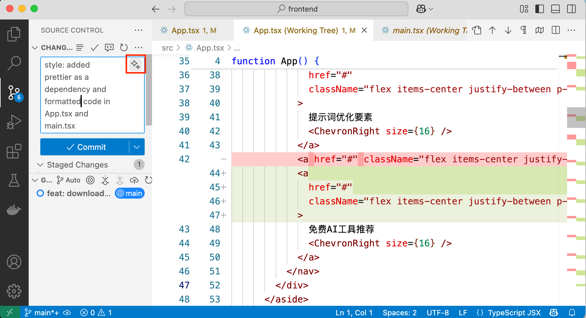

图4-15 自动生成提交信息

<aside>
💡

【避坑指南】如何让提交信息更可读？

为了提高提交信息的可读性，便于通过git查看近期代码变更，你可以采取两个措施：首先是在完成每个原子化的代码变更后立即使用自动生成提交信息功能；其次是在提交信息开头添加Josh Buchea提出的语义化标记，用于说明此次提交的主要目的。例如，图4-14中的提交信息以"style: "开头，表明这是一次代码格式化。以下是几种常用的语义化标记。

- `feat`: 为用户实现的新功能
- `fix`: 为用户修复了bug
- `docs`: 更改了文档
- `style`: 格式化代码等
- `refactor`: 重构生产代码，例如重命名变量
- `test`: 添加缺失的测试、重构测试
- `chore`: 做了一些配置更改
</aside>

由于Copilot自动生成提交信息不仅便利，而且频繁的小批量代码提交有助于追踪代码变更，因此本书后续将在完成每个原子性小功能后默认提交一次代码，不再特别说明。

### 4.5.4 用Inline Chat的/doc为App.tsx加注释

为了理解App.tsx代码文件的原理，可以使用Copilot的Inline Chat（内联聊天）功能来添加和阅读代码注释。操作步骤如下：首先选中需要操作的代码，由于此时要为整个App.tsx文件添加注释，可以使用快捷键（Mac用Cmd+A，Windows/Ubuntu用Ctrl+A）选中所有代码。然后使用下面列出的Inline Chat快捷键激活内联聊天，最后输入"/"。

<aside>
💡

【Inline Chat快捷键】

Mac：Cmd+I

Windows/Ubuntu：Ctrl+I

</aside>

这样就能列出AI所能执行的各种智能操作，如图4-16所示。


图4-16 用快捷键Cmd+I或Ctrl+I进入Inline Chat

为了添加注释，选择"/doc"命令（可以看到Inline Chat输入框右侧显示默认使用GPT-4o大模型，经过我的试用，发现这个大模型编写文档能力优于其他4个），然后加入RABPOC风格的提示词，具体如下：

```markdown
/doc 作为web前端开发高手，请为新手就我选中的代码写注释，要求新手读完后。能理解这些代码的作用，以便将来需要修改代码时，知道去哪里修改。如果你看不懂，就直说，不要编造。
```

之后按回车，Copilot就会开始生成注释文档。点击Accept接受后，代码注释就自动添加完成了。如图4-17所示。

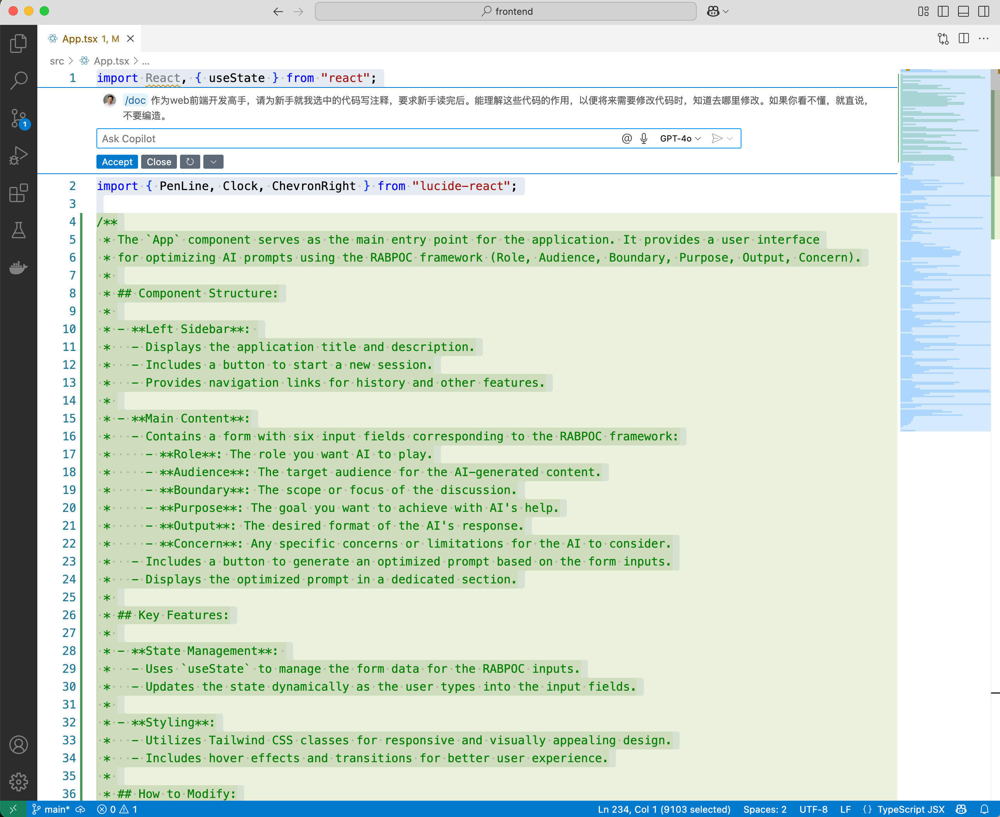

图4-17 通过Inline Chat添加了注释

图4-17所示的注释，包括了组件结构、关键功能、如何修改以及新手指南。通过阅读这些注释，就可以更好地理解App.tsx的代码结构，以便未来增加新功能或修复缺陷。

### 4.5.5 用Inline Chat的/fix修复问题

查看图4-10时，你会发现左侧边栏History下显示了两个示例历史对话的标题。由于原型目前尚未实现历史对话管理功能，这些示例并不合适显示。不过，我想保留bolt.new设计的历史对话标题样式，以便后期添加该功能时使用。解决方案是将这两条示例历史对话在代码中注释掉——这样代码中仍保留着相关内容，但用户界面上就不会显示了。

要注释掉前端代码的步骤很简单：在App.tsx中使用Shift+方向键选中目标代码（选中<nav>标签内包含两条对话标题的所有内容），然后按Inline Chat快捷键，输入"/fix"命令，并添加提示词"请注释掉所选代码"。按回车确认后，点击两次Accept即可完成操作。如图4-18所示。

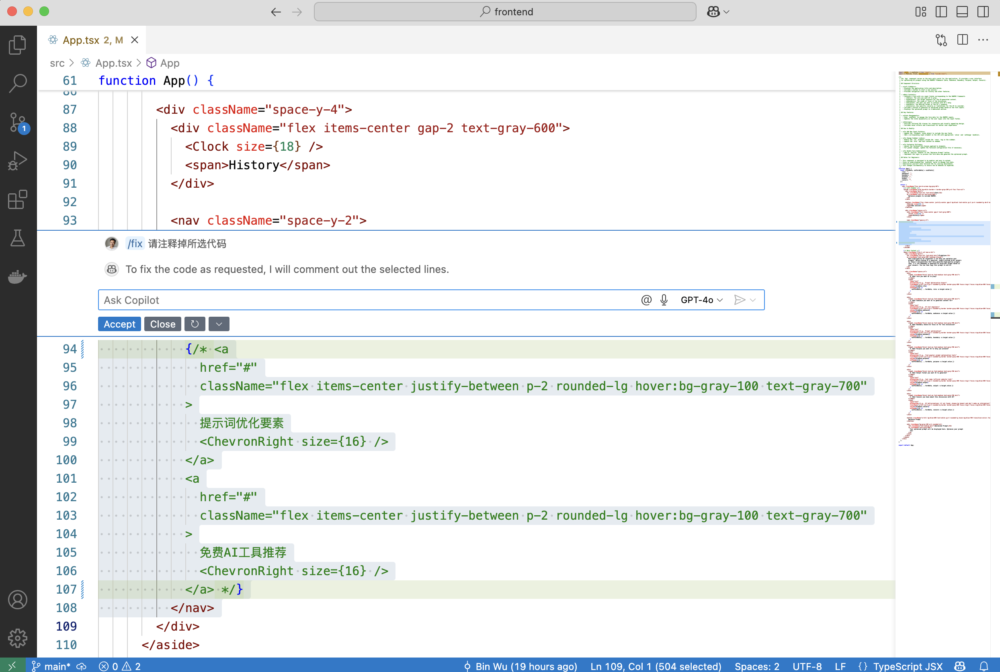

图4-18 用”/fix”注释掉代码

前端代码的准备工作已经接近尾声。接下来开始编写后端代码。

## 4.6 生成Node.js后端代码

从图4-2架构图中前端指向后端的箭头描述可见，前端需要将提示词发送至后端，后端再通过DeepSeek API对这些提示词进行优化。因此，在着手开发后端代码前，需要先在前端准备好这些提示词。为了便于查看提示词的准备状态，我计划实现如下功能：当用户点击Optimize Prompt按钮后，在Optimized Prompt区域下方显示已准备好的提示词。

### 4.6.1 备好发给后端的提示词与Edit子模式

在通过4.5.4节的注释理解了App.tsx代码后，我发现只需在App.tsx文件中修改代码就能完成后端提示词的准备工作。针对这种已明确需要修改哪些文件的场景，就可以在Copilot的Chat模式中使用Edit子模式（见4.2.2）。具体步骤如下。

（1）确保Copilot正处于Chat模式。

（2）选择App.tsx作为上下文：点击VSCode左上角Explorer图标，在my-copilot目录树中找到并点击frontend/src/App.tsx文件打开，使其成为当前（current file）文件。该文件会自动添加到VSCode界面右下方的Context中（显示为"App.tsx Current file"），作为与大模型对话的上下文，如图4-19所示。

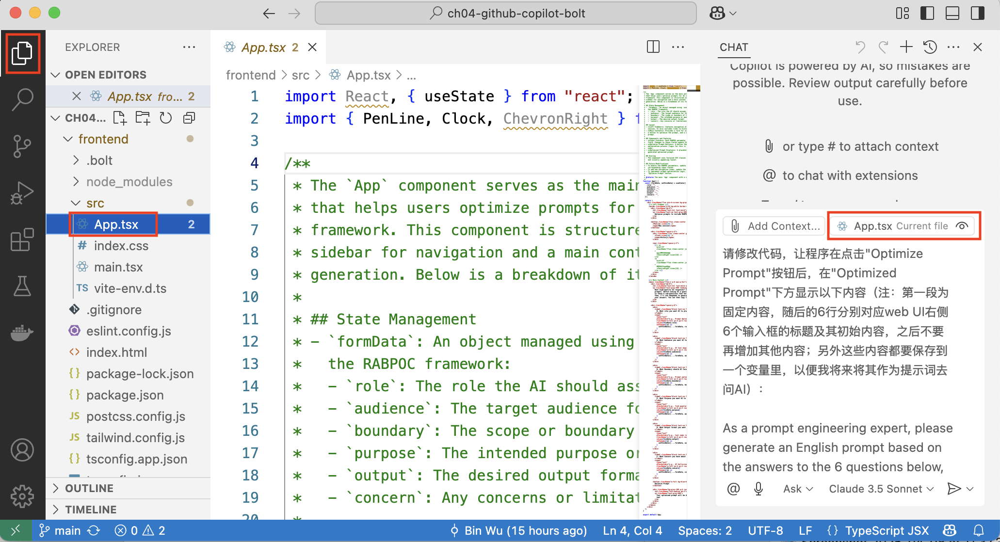

图4-19 打开App.tsx后自动成为上下文

<aside>
💡

【避坑指南】如何把多个文件加入上下文？

虽然当前文件会自动加入上下文，但同一时间只能有一个当前文件。如果想添加多个文件到上下文，可以在Explorer的目录树中找到目标文件，右击后选择Copilot → Add File to Chat。重复这个步骤，直到添加完所有需要的文件。如图4-20所示。

</aside>

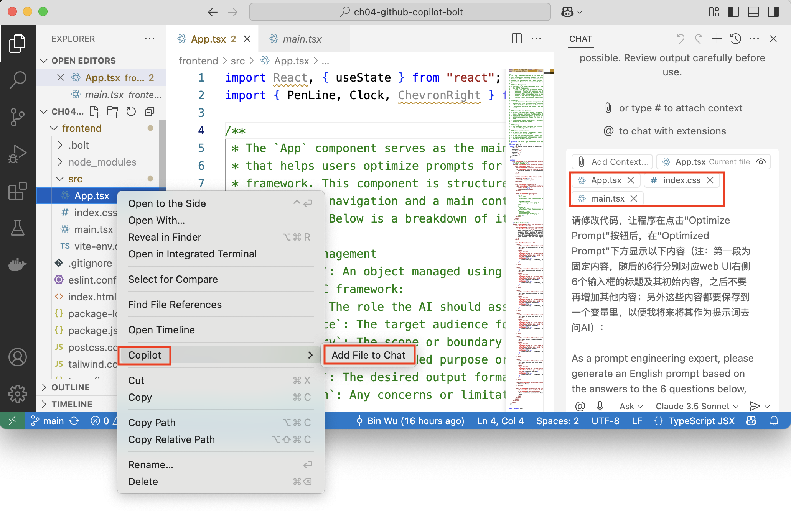

图4-20 把多个文件加入上下文

（3）选择Edit子模式：在Ask Copilot输入框下方，点击按钮切换至Edit子模式。

（4）选择Claude 3.5 Sonnet大模型。

（5）输入提示词：将代码清单4-5中的提示词复制并粘贴到Ask Copilot输入框中。

代码清单4-5 ch04-copilot/prompts/prompt-build-prompt-for-optimization.md

```markdown
请修改代码，让程序在点击"Optimize Prompt"按钮后，在"Optimized Prompt"下方显示以下内容（注：第一段为固定内容，随后的6行分别对应web UI右侧6个输入框的标题及其初始内容，之后不要再增加其他内容；另外这些内容都要保存到一个变量里，以便我将来将其作为提示词去问AI）：

As a prompt engineering expert, please generate an English prompt based on the answers to the 6 questions below, targeting AI beginners. The prompt must incorporate the content from all 6 answers to help formulate high-quality questions for AI. Please provide only the prompt itself, without any additional content.

What Role you want AI to play? Prompt Optimization Expert.

What Audience you want AI to generate content for? AI tool beginners.

What Boundary should AI focus on for this discussion? Prompt optimization.

What Purpose you want AI to help you achieve? find popular prompt optimization tools.

What Output format you want AI to generate? tool name (official website link).

What Concern you have about this discussion with AI? AI hallucinations (if not found, please be honest and don't make up information).
```

（6）提交：在Ask Copilot输入框中按回车键提交提示词。Copilot随后会将提示词转发给所选大模型处理，片刻后你就能看到回复。在屏幕下方的蓝色悬浮工具栏中，可以使用上下箭头查看代码改动。确认改动无误后，点击Keep接受修改。如图4-21所示。


图4-21 在Edit子模式下修改上下文中的文件的代码

（7）运行并测试：在VSCode的内置终端里运行前端（相比在外部终端运行，使用VSCode内置终端的好处是出现错误时可以方便地将错误信息提供给Copilot进行问题排查），以测试AI是否成功实现了"备好发给后端的提示词"的功能。打开VSCode内置终端的方法是：在菜单栏选择Terminal，点击New Terminal。在打开的终端界面中，输入命令`cd frontend`进入前端目录，然后运行`npm run dev`启动前端服务。接着按住快捷键（Mac用Cmd，Windows/Ubuntu用Ctrl）并点击终端中出现的链接`http://localhost:5174/`，即可在浏览器中查看前端界面。如图4-22所示。

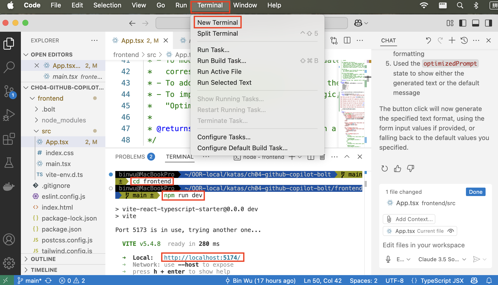

图4-22 在VSCode内置终端里运行前端

点击前端界面的"Optimize Prompt"按钮后，下方会显示准备好发送给后端的提示词。至此，就可以开始编写后端代码了。

### 4.6.2 生成后端代码与Agent子模式

由于需要基于现有前端代码使用Vibe编程让AI生成后端代码，这与4.2.2中介绍的Agent子模式在搭建新功能方面的优势不谋而合。因此使用Agent子模式来生成后端代码。具体步骤如下：

（1）申请DeepSeek API密钥：在搜索引擎中搜索"deepseek api"，找到DeepSeek官方API文档。文档中提供了API密钥的申请链接（通过该密钥，你可以按token使用量付费的方式调用DeepSeek大模型服务）。如图4-23所示。


图4-23 找到DeepSeek官方API文档

（2）充值：申请成功后，进行充值即可启用DeepSeek优化提示词的功能，以实现Promptyoo-0原型。我充了50元，编程量不大的话，能用好几个月。

（3）查看API示例：在图4-22下方可以找到Node.js版本的API调用示例代码。

（4）确保Copilot处于Chat模式。

（5）选择Agent子模式：在Ask Copilot输入框下方，点击按钮切换至Agent子模式。

（6）选择Claude 3.5 Sonnet大模型。

（7）输入提示词：将代码清单4-6中的提示词复制并粘贴到Ask Copilot输入框中。值得注意的是，在Agent子模式下输入"/"时，仅会显示一个"/clear"选项（打开一个新的聊天对话，与后面将要介绍的New Chat快捷键等效），不同于Ask子模式中可提供多种智能操作选项。

代码清单4-6 ch04-copilot/prompts/prompt-add-backend.md

```markdown
你作为node.js专家，请用2025年node.js最流行的技术和最佳实践，在backend目录下创建一个node.js后端应用，允许frontend目录下的React前端应用 #codebase  调用该后端，并通过后端向DeepSeek官方API发送请求。调用DeepSeek API的node.js示例代码见后文。

同时，请修改前端代码实现以下功能：当用户点击"Optimize Prompt"按钮时，前端将App.tsx文件的template变量内容通过node.js后端发送给DeepSeek。发送前，清空UI右侧最下方"Optimized Prompt"下的所有内容。收到DeepSeek回复后，将回复内容显示在"Optimized Prompt"下方。

如果DeepSeek长时间未响应，则在"Optimized Prompt"下方显示"DeepSeek没有响应"。

另外请将DeepSeek API key（值为sk-bxxx）保存在backend/.env文件里。下面是调用DeepSeek API的node.js示例代码：
```jsx
// Please install OpenAI SDK first: `npm install openai`

import OpenAI from "openai";

const openai = new OpenAI({
        baseURL: 'https://api.deepseek.com',
        apiKey: '<DeepSeek API Key>'
});

async function main() {
  const completion = await openai.chat.completions.create({
    messages: [{ role: "system", content: "You are a helpful assistant." }],
    model: "deepseek-chat",
  });

  console.log(completion.choices[0].message.content);
}

main();
```

（8）提交并处理：在Ask Copilot输入框中按回车键提交提示词。Copilot会将提示词转发给所选大模型处理。提示词中的"#codebase"生效后，Copilot开始阅读代码库中的文件，并分步执行操作。首先，它创建"backend/scr"目录，并提供Continue按钮供点击。点击后，Copilot自动打开内置Terminal终端执行创建目录命令。接着提示进入backend目录并执行"npm init -y"命令，同样提供Continue按钮待确认。整个过程就是这样循环往复。

在执行过程中，如果Copilot发现Terminal终端出现命令错误，它会立即提供修复命令并等待Continue按钮确认。修复完成后，它会通知修复成功，并询问是否继续。期间它会创建.env文件来存储敏感的DeepSeek API密钥（由于已在项目根目录的.gitignore文件中设置忽略.env文件，密钥只会保存在本地，不会提交到git版本库造成泄密）。Copilot会列出所有修改的文件供查看，并提供Keep按钮以确认修改。如图4-24所示。


图4-24 在Agent子模式中生成后端代码

在.env文件中将DEEPSEEK_API_KEY更新为真实密钥后，我点击了Keep和Continue按钮。Copilot继续生成前后端集成代码和后端代码。我仔细检查了更新的代码（虽然有些代码我看不太懂），并陆续点击Keep和Continue按钮确认。

（9）运行并测试：代码生成完成后，Copilot指示我启动后端和前端应用进行测试。当我按Continue按钮启动后端应用时，新打开的内置Terminal终端提示server.ts文件第19行运行时报错："src/server.ts:19:27 - error TS2769: No overload matches this call."——Copilot却没有察觉到这个问题。随后，它让我在另一个内置Terminal终端启动前端应用。前端应用虽然成功启动，但当我访问本地服务器并点击优化按钮时，页面果然显示错误提示："Error: Failed to optimize prompt. Please try again."

### 4.6.3 修复运行错误与Ask子模式下的@terminal

由于需要修复内置终端的后端运行错误，我需要在提示词中使用"@terminal"命令。但在Agent子模式下无法使用该命令，因此我切换回了Ask子模式。

根据错误信息，问题出在server.ts文件中。我在Copilot中打开了这个文件，以便Copilot能准确定位并修改出错的代码位置（如果没有打开文件，Copilot会提示你打开）。

接着，我选中了终端中的错误信息（这样可以使用#terminalSelection聊天变量来引用所选内容），然后输入了如下提示词，如代码清单4-7所示。

代码清单4-7 ch04-copilot/prompts/prompt-terminal-explain-terminalSelection.md

```markdown
@terminal /explain 请解释后端运行错误 #terminalSelection
```

Copilot提供了解决方案，不仅给出了需要修改server.ts文件的具体建议，还附上了修复后的代码片段。当我点击代码片段左上角的Apply to按钮后，Copilot自动跳转到文件中需要修改的位置，清晰地展示了修改前后的对比，并通过Keep按钮等待我确认这些更改。如图4-25所示。


图4-25 Copilot能自动定位需要修改的代码位置

修改代码后，我在内置终端使用命令`npx ts-node src/server.ts`重新启动后端来验证修复效果，但仍然报错。这次我没有在终端中选择错误信息，而是直接向Copilot输入了一个简洁的提示词，只包含聊天参与者和智能操作（输入"/explain"时，Copilot会自动添加"@terminal"前缀），以及聊天变量"#terminalLastCommand"（用于引用终端中最后执行的出错命令）。这种精简的写法大大简化了修复终端错误的流程，避免了编写冗长的自然语言提示词和手动选择错误信息的麻烦，如代码清单4-8所示。

代码清单4-8 ch04-copilot/prompts/prompt-terminal-explain-terminalLastCommand.md

```markdown
@terminal /explain #terminalLastCommand
```

Copilot又发现了一些问题并提供了解决方案。我采用vibe编程的方式，快速浏览它的解释，点击Apply to按钮应用更改，检查代码比对后点击Keep确认。重启后端后问题依然存在。经过两轮类似的vibe编程修复循环后，终端终于不再报错，而是显示了"Server is running on port 3000"这样令人欣慰的成功信息。

### 4.6.4 点按钮无反应与Ask子模式下的/fix

我的喜悦可能太早了。在另一个终端启动前端并通过链接访问页面后，我发现点击Optimize Prompt按钮毫无反应。看来还需要让Copilot帮忙解决这个问题。

由于后端运行错误已经修复完毕，我通过New Chat快捷键开启了一个全新的对话（这样可以避免受到上一个对话上下文的影响）。

<aside>
💡

【New Chat快捷键】

Mac/Windows/Ubuntu：Ctrl+L

</aside>

运行后端应用时使用终端有一个重要优势：可以通过终端查看详细的运行时日志，获取更丰富、更准确的错误信息，这比前端界面显示的简单错误提示要有用得多。因此，在新的聊天对话中，我加入了下面与日志（log）相关的提示词来请求Copilot修复问题，如代码清单4-9所示。

代码清单4-9 ch04-copilot/prompts/prompt-workspace-fix-codebase.md

```markdown
@workspace /fix 我在一个terminal里运行“npx ts-node-esm src/server.ts”来运行backend，然后在另一个terminal里运行“npm run dev"来运行frontend。我用浏览器访问前端，点击Optimize Prompt按钮后，界面没有反应。请你查看 #codebase ，并在后端server.ts代码里增加打印log功能，使得当我点击Optimize Prompt按钮后，能在后端的terminal里看到后端访问deepseek api的log。
```

这个提示词结合了"/fix"命令（用于请求@workspace这位聊天参与者修复问题）和"#codebase"聊天变量。

修改成功！我按照Copilot提供的代码更新了server.ts文件并重新运行。当点击Optimize Prompt按钮后，稍等片刻（因为需要等待DeepSeek API的响应），页面上便显示出了DeepSeek优化后的提示词，如图4-26所示。


图4-26 成功获得了DeepSeek优化后的提示词

后端终端中也同时显示了相应的操作日志。如图4-27所示。


图4-27 后端终端中显示出日志

测试运行通过，准备提交代码时，我发现Copilot左侧边栏的Source Control图标显示有2000多个待提交文件！这是由于项目根目录缺少.gitignore文件导致的——该文件用于指定哪些文件无需纳入版本控制，比如npm安装的大量依赖包。为解决这个问题，我开启了一个新的聊天对话，写了下面的提示词让Copilot帮我生成.gitignore文件，如代码清单4-10所示。

代码清单4-10 ch04-copilot/prompts/prompt-workspace-codebase.md

```markdown
@workspace 请你在根目录下创建一个合理的.gitignore文件，以便我在运行git add时，只添加 #codebase 中必要的frontend和backend目录下的源文件到版本库。
```

这个提示词使用了"@workspace"聊天参与者和"#codebase"聊天变量。

由于.gitignore文件尚未创建，尽管Copilot已提供了文件内容，但无法直接使用Apply to按钮进行修改。我先手动创建了该文件，然后让Copilot进行修改。修改完成后，待提交的文件数量从2000多个显著减少到了6个。

当在前端界面看到DeepSeek成功返回优化后的提示词时，这标志着Promptyoo-0原型的基本功能已经完成。

从上述修复问题的经历可以看出，影响使用vibe编程解决问题效率的因素主要有三点：

（1）编程知识的深度。例如，了解DeepSeek API密钥的安全性要求后，就能引导Copilot将其存储在.env文件中，并通过.gitignore文件排除.env，防止敏感信息被纳入版本控制。同样，理解日志在调试过程中的重要性，也能恰当地指导Copilot添加必要的日志功能。

（2）对AI编程助手功能的掌握程度。比如当了解到可以在Copilot内置终端运行程序，并善用聊天参与者、智能操作和聊天变量来简化提示词后，遇到终端运行错误时，就能够使用简洁的`@terminal /explain #terminalLastCommand`提示词来准确定位并解决问题。

（3）聊天对话中问题的粒度以及提示词是否遵循RABPOC风格。以代码清单4-9为例，解决按钮无反应的提示词专注于这一个具体问题，保持了原子化的粒度。此外，提示词在要求"在后端server.ts代码里增加打印log功能"之后，还明确说明了目的："使得当我点击Optimize Prompt按钮后，能在后端的terminal里看到后端访问deepseek api的log"。这种明确目的的方式能够帮助AI更准确地解决问题。

对于“用完即扔”的"一次性"的软件项目来说，Promptyoo-0原型能从DeepSeek获得优化后的提示词就已足够。但对于需要长期维护的项目，无论是个人开发还是团队协作，都需要通过自动化单元测试来保护代码的关键逻辑。这里的单元测试指前端只测试前端本身，后端只测试后端本身（因篇幅所限，本书不讨论端到端自动化测试，即通过前端测试后端）。随着时间推移，开发者难免会遗忘细节或出现失误。如果没有自动化单元测试的保护，在使用AI助手增加新功能或修复问题时，很可能会不经意间破坏原本正常运行的代码。

如果你现在对使用AI编程助手生成单元测试来保护代码逻辑不感兴趣，也不想了解如何通过代码评审持续改进代码质量，可以先跳过后续内容，只浏览章节标题即可。当你以后产生兴趣时再回来阅读。如果你已经对此感兴趣，那么欢迎一起探索如何使用AI来生成和运行前端自动化单元测试。

## 4.7 前端单元测试

相比生成生产代码（即运行应用的实际代码，因可能会被部署到企业数据中心的生产环境中而得名）的选择技术栈和生成应用这两步，AI生成单元测试代码的步骤也大体类似。不同的是，需要多一个步骤来验证自动化测试是否能有效保护代码。

（1）搭建单元测试框架并编写简单测试

（2）生成覆盖关键业务逻辑的单元测试

（3）验证自动化测试是否起到保护作用（融入前两步中）

先看第一步。

### 4.7.1 搭建测试框架与/setupTests

因为要编写前端单元测试，不需要后端代码，所以可以让VS Code只打开前端项目（在终端中进入front目录后运行`code .`即可）。这样可以避免后端代码带来的干扰。

在Chat模式下选择Ask子模式后，先打开App.tsx文件作为提问的上下文，再选择Claude 3.5 Sonnet作为大模型。接着使用代码清单4-9中带有/setupTests（在项目中搭建单元测试框架）的提示词，Copilot就会推荐合适的前端测试框架。

代码清单4-9 ch04-copilot/prompts/prompt-frontend-unit-test-framework.md

```markdown
@workspace /setupTests 作为前端自动化单元测试专家，请阅读App.tsx代码，为我推荐2025年最流行的前端单元测试框架。请帮我搭建该框架，并编写一个简单的测试用例（如验证前端页面中Optimize Prompt按钮是否存在），以便我确认测试框架能否正常运行。
```

Copilot推荐了Vitest作为前端单元测试框架。点击Apply Changes按钮后，它自动创建了相关测试文件。随后，我执行了它提供的依赖库安装命令，并在内置终端中完成安装。最后，我在终端中运行`npm test`来运行单元测试并查看结果，却看到了下面的出错信息。

```bash
npm ERR! Missing script: "test"
```

这个信息是什么意思？我于是输入下面的提示词来求助。

```bash
@terminal /explain #terminalLastCommand 
```

Copilot解释说，这是因为package.json文件中未定义test脚本。于是它提供了下面添加test脚本的代码，如代码清单4-10所示。

代码清单4-10 在package.json文件中将test脚本定义为react-scripts test

```json
{
  "scripts": {
    "test": "react-scripts test"
  }
}
```

我按照指示添加后，再次运行`npm test`，却遇到了下面新的错误信息。

```bash
sh: react-scripts: command not found
```

我于是再次用提示词`@terminal /explain #terminalLastCommand` 求助。

这次Copilot解释说，由于项目是基于 Vite 构建的 React TypeScript 项目，不应该使用来自 Create React App 的 `react-scripts`，而应该按照代码清单4-11的方式修改 package.json 文件，改用 Vitest 进行测试。

代码清单4-11 在package.json文件中将test脚本定义改为vitest

```json
{
  "scripts": {
    "test": "vitest"
  }
}
```

我心里暗想，这前后矛盾不就是Copilot你自己吗——先建议使用react-scripts test，现在又说这样不对。不过作为前端开发新手，面对这位"AI大师"，我也只能乖乖接受它新给出的代码继续尝试。按照它的指示，我还创建了一个新的vitest.config.ts配置文件，并按提供的代码实现。

我再次运行 npm test，想看看会出现什么新问题。果然不出所料，终端提示了"No test files found"（未找到测试文件）。

当我使用提示词`@terminal /explain #terminalLastCommand`寻求帮助时，突然发现Copilot在创建的三个测试文件名后都添加了"# 测试文件"这样的像是注释的字符串。这就解释了为什么会报错说找不到测试文件。这似乎是Copilot的一个bug，于是我手动将这些文件名修改为正确的样子。再次运行npm test，谢天谢地，这次测试运行成功。

我打开App.test.tsx文件查看测试的具体内容。发现Copilot只添加了一个基础测试，仅检查App组件是否能渲染并验证document.body.innerHTML是否包含内容。这与我在代码清单4-9中要求的"验证前端页面中Optimize Prompt按钮是否存在"的测试目标并不相符。

### 4.7.2 验证按钮的前端单元测试与/tests

接下来，我输入了以下带有/tests（用于生成单元测试）的提示词。

```markdown
@workspace /tests 请编写一个简单的单元测试代码，验证前端页面中Optimize Prompt按钮的显示名是否正确
```

Copilot随后在App.test.tsx文件中添加了一个单元测试。我点击Keep接受了这个更改。但在运行npm test命令时，新增的单元测试却出现了一个错误。

```markdown
Error: Invalid Chai property: toHaveTextContent
```

由于测试运行失败，我使用了下面这个带有#testFailure（运行失败的测试）聊天变量的提示词，请求Copilot帮助修复问题。

```markdown
@terminal /explain #testFailure
```

Copilot解释说问题出在`toHaveTextContent`这个匹配器在当前环境中无效。由于项目使用的是Vitest和React Testing Library，我需要使用正确的断言方法。它随后提供了修复测试的具体方案。

```tsx
// 把这行
expect(optimizeButton).toHaveTextContent('Optimize Prompt')

// 改为
expect(optimizeButton.textContent).toBe('Optimize Prompt')

// 或者改为
expect(optimizeButton).toHaveTextContent(/Optimize Prompt/i)
```

修改完这些代码后，我运行 npm test，两个测试终于都顺利通过了。接下来需要验证这些辛苦编写的单元测试是否真能有效保护 Optimize Prompt 按钮显示名称的正确性。

### 4.7.3 验证前端单元测试的保护效果

要验证单元测试的保护效果，最简单的方法是故意破坏单元测试所保护的生产代码逻辑。这样可以模拟一段时间后，自己或他人意外修改了原本正常工作的代码。

我把App.tsx文件中优化提示词按钮的显示名从"Optimize Prompt"改为"Optimize the Prompt"，然后运行npm test。测试确实运行失败了。这说明单元测试确实起到了保护作用。

但在查看测试失败信息时，我惊讶地发现它竟然有693行。这让我难以直观地看出期望值（"Optimize Prompt"）与实际值（"Optimize the Prompt"）之间的差异。

我于是写了一段提示词问Copilot，如代码清单4-12所示。

代码清单4-12 用“@terminal /explain #testFailure”来解决冗长测试失败信息问题

```markdown
@terminal /explain #testFailure 其实我就是想在测试失败信息里明确地看到实际值与期望值之间的差异，但测试失败信息实在太长，难以直观看到差异。请问是否有简单的办法让我能在测试失败信息里直观地看到差异？
```

尝试了Copilot的解决方案后，测试失败信息依然冗长。我接着尝试了三种不同的提示词，只是将代码清单4-12开头的三个聊天相关的缩略语替换掉，保留了后面的提示词内容。我先后使用了"@terminal /explain #terminalLastCommand"和"@workspace /fix #file:App.test.tsx"（注意我使用了`#file:`聊天变量，以明确地在上下文中指定某个文件），并采纳了Copilot提供的解决方案，但冗长的问题始终未能解决。最后，我尝试使用"@workspace /tests #terminalSelection"并选中了测试失败信息，但Copilot完全理解错了我的意图——它竟然建议把测试代码的期望值改成那个故意写错的"Optimize the Prompt"，只是为了让测试通过。

无奈之下，我转而求助Claude官网（如未明确说明选择Extended thinking或Web search，则仅选择Claude 3.7 Sonnet，下同）。使用相同的提示词后，Claude提供了一个完美的解决方案——测试错误信息清晰地展示了期望值与实际值的对比。这个经历让我意识到，了解不同AI编程助手各自的优势有多么重要。

显然，目前的两个测试还远远不够。还需要继续编写更多关键的前端单元测试代码。

### 4.7.4 生成其他关键前端单元测试

为了让Copilot基于已有代码生成更多关键的单元测试，我打开了App.tsx文件作为上下文参考，然后输入了以下提示词。如代码清单4-13所示。

代码清单4-13 github-copilot-bold/prompts/prompt-frontend-unit-tests-in-given-when-then.md

```markdown
@workspace /tests 作为前端自动化单元测试专家，请帮我阅读App.tsx代码，并告诉我这个前端应用需要哪些关键的单元测试。请按重要性从高到低排序列出测试用例，每个测试都需要包含以下三个部分：
- given（前置条件）
- when（待测行为）
- then（验证结果）
只需提供文字描述即可，无需提供具体测试代码。
```

Copilot不仅按照given-when-then格式列出了5个测试用例，还主动生成了相应的测试代码供我确认采用。然而，当我运行npm test时，这5个新生成的单元测试却全部失败了。其中3个测试显示错误"ReferenceError: userEvent is not defined"，另外2个则报错"Error: Invalid Chai property: toBeInTheDocument"。

我打开了App.test.tsx测试文件作为上下文，并使用`@terminal /explain #testFailure`提示词寻求帮助。Copilot准确地识别出了上述两类错误，并为每个错误提供了解决方案。按照其建议修改后，我再次运行npm test，总算错误信息变了（这很好，因为意味着之前的错误已经被修复），虽然这次只有一个单元测试运行失败，但测试错误信息依然冗长——整整569行。

由于测试错误信息过于冗长，我求助了Claude官网来分析关键问题。Claude指出失败的测试用例名称是"updates form state when user enters input"，错误信息显示"TestingLibraryElementError: Found multiple elements with the role 'button'"。这个错误出现是因为测试代码在第29行使用了screen.getByRole('button')，但页面中存在两个按钮：侧边栏的"新会话"按钮和表单中的"优化提示词"按钮。当使用getByRole('button')时，测试库预期只能找到一个按钮，但实际找到了多个匹配项。因此，测试代码需要更精确地指定要定位的具体按钮。

为了修复这个问题，我使用了提示词`@terminal /explain #testFailure`。然而，Copilot的回复偏离了重点：它提到依赖库已经安装完成，App.test.tsx文件中的import语句没有问题，并建议重新运行npm test。更让人困惑的是，它又建议导入vi依赖库（这与之前说import语句完全正确的说法相矛盾），还不忘提出了一个无关的测试代码组织建议。

我尝试使用另一个提示词`@workspace /explain #testFailure`继续询问。然而，Copilot的回复完全偏离了问题重点，它只是列出了7个单元测试的given-when-then描述。当我改用`@workspace /fix #testFailure`时，Copilot又误以为要修复"vi未定义"的错误，而这根本不是当前需要解决的问题。显然，AI在这里产生了幻觉。

带着一丝失望，我决定换一种方式，用一个新的提示词，并在后面用清晰的自然语言表达我的需求——让Copilot直接解释测试失败的具体原因。

```markdown
@terminal /explain #terminalLastCommand 请解释测试运行时哪里出错了，出错信息太长，找不到重点。
```

这次Copilot终于给出了有用的回答。它不仅提供了与上面Claude相同的错误原因分析，还提供了具体的解决方案——使用更精确的选择器。如代码清单4-14所示。

代码清单4-14 在测试代码中使用更精确的选择器以修复测试错误

```jsx
await user.click(screen.getByRole('button', { name: /optimize prompt/i }));
```

我点击了Copilot在代码清单4-14所给出代码片段右边的Apply in Editor按钮，但发现Copilot仅仅扫描了App.test.tsx文件中的代码，并未做任何修改。经仔细检查测试代码后发现问题所在：由于解决方案提供的正确代码行已出现在测试代码的其他位置（第38行），Copilot误以为替换已完成，因此忽略了第29行的问题代码。这让我发现了Copilot的另一个bug。如图4-28所示。


图4-28 由于解决方案提供的正确代码行已出现在测试代码的其他位置导致Copilot误以为替换已完成

由此可见，使用Copilot进行单元测试的vibe编程比编写生产代码时更容易出错。要解决这些问题，需要尝试不同的提示词来找到最有效的解决方案、仔细分析Copilot的回复并做出合理判断，以及在Copilot无法解决问题时，寻求Claude等其他AI编程助手的帮助。

完成前端单元测试后，下面继续使用vibe编程方式来编写后端单元测试。

## 4.8 后端单元测试

与生成前端单元测试类似，使用vibe编程生成后端单元测试也分为三个步骤：搭建单元测试框架、生成覆盖关键业务逻辑的单元测试，以及验证自动化测试的保护作用。不过，后端单元测试与前端有一个重要区别——需要考虑依赖注入。

依赖注入是一种设计模式，它允许从外部传入组件所需的依赖对象，而不是在组件内部直接创建。这种方式能显著提高代码的可测试性，因为可以在测试时轻松地用模拟对象（mock）替换真实的依赖。在后端单元测试中，经常需要模拟数据库连接和外部服务调用（例如调用DeepSeek API）等依赖，这正是依赖注入发挥作用的地方。通过使用mock，就可以验证后端代码是否正确调用了外部服务，而无需在单元测试时实际连接这些服务。

下面先尝试用Copilot来生成后端单元测试。

### 4.8.1 用/setupTest时踩坑

与前端单元测试类似，编写后端单元测试时只需要后端代码，因此可以让VS Code仅在backend目录下打开后端项目，避免前端代码造成干扰。

在Chat模式下选择Ask子模式后，先打开src/server.ts文件作为提问上下文，然后选择Claude 3.5 Sonnet作为大模型。接着，使用带有/setupTests的提示词，让Copilot推荐后端测试框架。

```markdown
@workspace /setupTests 请阅读 server.ts 的后端代码，使用 2025 年主流的单元测试框架和依赖注入技术，编写关键单元测试。测试需要验证后端代码是否正确调用了 DeepSeek API，但无需实际调用真实 API。你可以修改现有后端生产代码，便于使用依赖注入技术注入 mock 对象，并通过 mock 验证对 DeepSeek API 的调用。
```

Copilot回复说会帮助搭建Jest和TypeScript测试环境，选择这两个工具是因为它们拥有广泛的使用基础和完善的支持。同时，它会根据我的要求使用依赖注入方式来模拟OpenAI客户端。

随后，它生成了一个文件列表，其中包含需要新建和修改的文件，这些文件都位于backend目录下。在文件列表下方有一个Apply Changes按钮。当我点击这个按钮时，却发现了三个令人头疼的问题。

首先，它在当前backend目录下又创建了一个新的backend目录，并将生成的文件放在其中。这就需要我手动将文件移到上一级目录，还要删除多余的backend目录。其次，当我查看它所修改的文件（文件名后带有" # modified"后缀）时，发现代码内容不完整，也没有说明在原文件中应该在哪里插入或替换这些代码。最后，它给所有新建和修改的文件都添加了" # new file"或" # modified"这样的后缀，这些后缀会导致文件无法执行，需要逐个手动删除。

尽管这种 vibe 编程方式令人挫折，但转念一想，问题可能出在我的提示词表述不够清晰。于是我决定换一种方式，用下面这种新的提示词再次尝试生成后端单元测试。

```markdown
@workspace /setupTests 请阅读 #file:server.ts 文件，并使用 2025 年主流的单元测试框架和依赖注入技术，编写一个关键单元测试。该测试需要验证后端代码是否正确调用了 DeepSeek API。我们将通过依赖注入技术注入 mock 对象来验证 API 调用，无需调用真实 API。

你可以修改现有后端生产代码以便于注入 mock 对象。为了降低测试修复工作量，请只编写这一个单元测试，其他测试后续再补充。

请注意：
1. 将本项目根目录视为 backend 目录，无需创建新的 backend 目录
2. 如需修改现有代码，请直接在原文件上修改或提供完整的修改后代码供手动替换
3. 不要创建带有"(modified)"等后缀的新文件
```

虽然提示词中的注意事项已经表述得十分明确，但令人意外的是，Copilot完全忽视了这些具体要求，之前提到的三个棘手问题仍然存在。

鉴于此，我决定转而尝试使用Claude官网。

### 4.8.2 用Claude官网时踩坑

我使用`git restore .`命令（注意后面有一个小数点，表示恢复所有改动的代码文件）将代码还原到最初未编写后端单元测试的状态（这很好地体现了使用git进行代码版本管理的优势），同时删除了此前Copilot新建的所有文件。

由于无法直接在Claude官网（即官方网页端，Claude还提供功能相似的电脑端App，为行文方便，以下统称Claude官网）访问我的后端代码，我首先手动上传了关键后端代码文件（package.json、server.ts和tsconfig.json）。随后，我提供了目录文件清单，并附上了以下提示词。最后我选择了Claude 3.7 Sonnet大模型（未启用Extended thinking和Web search功能）。

```markdown
请阅读我上传的后端代码，然后使用 2025 年主流的单元测试框架和依赖注入技术，为src/server.ts编写关键单元测试。测试需要验证后端代码是否正确调用了 DeepSeek API，但无需实际调用真实 API。你可以修改现有后端生产代码，便于使用依赖注入技术注入 mock 对象，并通过 mock 验证对 DeepSeek API 的调用。下面是项目根目录的文件列表：
├── node_modules
├── package-lock.json
├── package.json
├── src
└── tsconfig.json
下面是src目录下的文件列表：
└── server.ts
```

Claude官网首先为我提供了下面的代码重构思路。

- 将现有的 server.ts 代码重构，把 Express 应用逻辑和 OpenAI/DeepSeek 客户端的创建分离出来
- 使用依赖注入模式，允许在测试时注入模拟的 OpenAI 客户端
- 使用 Jest 作为测试框架（2025年仍然是主流选择）
- 使用 supertest 来测试 Express 应用程序
- 使用 jest-mock 来模拟 OpenAI 客户端

随后，它像下面那样为我逐个提供了代码修改和新建文件的简要说明，并附上完整的源代码——这让我不必费心去定位在现有文件中应该插入或修改代码的具体位置。

- 首先，重构 server.ts 文件，使其更容易测试：（代码略）
- 现在，创建一个专门用于启动服务器的入口点文件，这样 server.ts 可以更专注于应用程序的逻辑：（代码略）
- 接下来，需要更新 package.json 以包含测试所需的依赖项和脚本：（代码略）
- 现在，创建 Jest 配置文件：（代码略）
- 接下来，创建测试文件：（代码略）
- 我注意到在测试文件中使用了 Vitest，但在 package.json 中配置的是 Jest。为了保持一致性，更新测试文件，使用 Jest 而不是 Vitest：（代码略）
- 为了能使用 ES 模块和 TypeScript 进行单元测试，需要对 tsconfig.json 做一些调整：（代码略）
- 现在创建一个单独的测试配置文件，专门用于 TypeScript 测试：（代码略）
- 更新一下使用的 mock 对象以及 API 调用方式，使其更符合实际需求：（代码略）
- 现在还应该添加一个断点调试配置，这样可以更容易地调试测试：（代码略）
- 创建一个整合测试，用于验证在实际环境中（但仍然使用模拟）应用程序的行为：（代码略）
- 最后，创建一个更详细的单元测试结构，专门为 createOpenAIClient 函数编写测试：（代码略）
- 现在，编写一个自述文件，解释如何运行和测试应用程序：（略）

Claude官网提供的解决方案不仅包含后端单元测试，还添加了一个整合测试，总共达到8个测试用例。这套方案表面上看起来全面而详尽，但后来证明这反而是个大坑。

我接受了Claude官网提供的所有建议，逐步修改代码，增加了8个单元测试，随后运行npm install和npm run dev来检验在为测试代码构建依赖注入的过程中是否影响了原本正常运行的后端服务。不出所料，当运行npm run dev时，server.ts文件报错：TypeError: (intermediate value).resolve is not a function。

通过Copilot很容易解决这个小问题。我在Copilot中输入提示词`@terminal /explain #terminalLastCommand`，它立即给出了解决方案。按照建议操作后，问题迎刃而解。运行npm run dev时，后端成功启动。接着我开启另一个终端运行前端应用，访问Promptyoo-0网页，确认提示词优化功能运行正常。现在可以开始测试后端单元测试的运行情况了。

我按Ctrl+C停掉前后端，然后在后端运行npm test，结果令人沮丧：测试失败信息多达232行，8个单元测试中有6个失败。要同时修复这6个失败的测试，还得确保其他2个测试和生产代码不受影响，这个任务实在棘手。这让我意识到，AI编程助手提供的那些看似完整而详尽的解决方案，在实际应用时往往会带来一大堆令人头疼的问题。

也许我应该让Claude官网只编写一个单元测试，这样会让我之后踩的坑要小一些。

### 4.8.3 换思路用好Claude官网

我将代码还原到最初未添加后端单元测试的状态，然后在浏览器中打开 Claude 官网，选择了 Claude 3.7 Sonnet 模型（没有选中Extended thinking和Web search）。我上传了后端的关键文件：package.json、tsconfig.json 和 server.ts，随后提供了以下强调只写一个单元测试的提示词。

```markdown
请阅读我上传的后端代码文件，并使用 2025 年主流的单元测试框架和依赖注入技术，编写一个关键单元测试。该测试需要验证后端代码是否正确调用了 DeepSeek API。请通过依赖注入技术注入 mock 对象来验证 API 调用，无需调用真实 API。

你可以修改现有后端生产代码以便于注入 mock 对象。为了降低测试修复工作量，请只编写这一个单元测试，其他测试后续再补充。
```

Claude官网很快回复说会帮我编写一个使用依赖注入和现代测试框架的单元测试，来验证后端代码是否正确调用了DeepSeek API。它对代码进行了以下的分析，然后修改生产代码以支持依赖注入，最后编写测试。

- 代码分析：后端使用Express创建了一个服务器，有一个`/api/optimize`端点调用DeepSeek API。关键点是：使用OpenAI客户端库连接到DeepSeek API；将用户提交的模板发送到DeepSeek API；返回优化后的提示。为了更好地支持测试和依赖注入，需要对`server.ts`进行一些重构。
- 重构后端代码：将OpenAI客户端的创建和路由处理分离，以便于依赖注入：（代码略）
- 添加测试配置：添加需要的测试依赖和配置文件。将使用Jest作为测试框架，并使用ts-jest运行TypeScript测试：（代码略）
- 编写单元测试：编写单元测试来验证DeepSeek API调用。将使用Jest的模拟功能来替换真实的OpenAI客户端：（代码略）
- 集成测试：添加一个简单的集成测试，使用supertest验证整个API端点：（代码略）

吸取之前的教训，我没有完全采纳Claude官网的所有建议，而是仅按照它的指导完成了"编写单元测试"及之前的部分，跳过了"集成测试"环节。另外，我在完成“重构后端代码”后，还没忘运行前后端应用，以验证这次重构并没有破坏之前能正常运行的提示词优化功能。

完成"添加测试配置"和"编写单元测试"后（Claude官网提供了两个单元测试：一个测试正常运行场景，另一个测试运行异常场景），我运行了npm install和npm test命令。但在执行__tests__/optimize.test.ts测试时，遇到了"SyntaxError: Unexpected identifier"错误。

我将错误信息提交给Claude官网寻求帮助。它分析了错误原因并提供了解决方案和完整代码。这样经过三轮反复调试和修改，两个后端单元测试终于全部通过。

由于在生成单元测试代码时，Claude官网同时修改了生产代码，这可能会破坏原本正常运行的代码逻辑。为了验证这一点，我重新启动了前后端进行测试。果不其然，当运行 npm run dev 时，src/server.ts 文件报错："error TS2709: Cannot use namespace 'OpenAI' as a type."

Claude官网解释这是因为它修改的 OpenAI 类型定义方式与原始代码不兼容，并提供了完整的修复代码。考虑到经过多轮问答后，Claude可能难以掌握最新生产代码的状态，我将当前所有生产代码重新上传（这正是使用网页版AI编程助手的一大不便）。Claude随后根据最新代码调整了解决方案，并提供了更新的修复代码。经过两轮调整后，后端单元测试和前后端应用的提示词优化功能都恢复了正常。这个经历表明，在生成后端单元测试时，让AI编程助手每次只完成最小范围的任务，才能避免陷入问题的泥潭。

### 4.8.4 验证后端单元测试的保护效果

与4.7.3类似，后端单元测试写好并运行通过且已验证没有破坏原有的提示词优化功能后，还要验证一下后端单元测试确实起到了保护作用才能放心。

该如何验证呢？可以继续借助AI编程助手。我将server.ts和optimize.test.ts添加到上下文中，然后使用以下提示词询问Copilot Pro中的Claude 3.7 Sonnet模型（订阅Copilot Pro每月10美元后，你可以选择使用Claude 3.7 Sonnet或Claude 3.7 Sonnet Thinking，因为分析单元测试的保护效果可能比单纯生成代码更复杂。当然，如果你使用免费版Copilot，选择Claude 3.5 Sonnet也可以。下同）。

```markdown
@workspace /explain 请阅读生产代码 #file:server.ts 和对应的测试代码 #file:optimize.test.ts，然后故意在生产代码中引入错误，使测试用例'should correctly call DeepSeek API and return optimized prompt'失败，以此验证该测试是否能够有效地发现代码问题，从而证明其保护作用。
```

Copilot Pro建议将server.ts文件中的`model: "deepseek-chat"`修改为`model: "deepseek-ai"`。这个修改会触发测试失败，因为测试用例专门检查DeepSeek API调用时是否使用了正确的模型参数值`'deepseek-chat'`。一旦将模型名称改为`'deepseek-ai'`，测试中的预期结果就会与实际API调用不符。

我照着试了一下，果然在运行npm test是发现测试运行失败，且能看到期望值与实际值的对比。这说明后端单元测试是有效的。如图4-29所示。

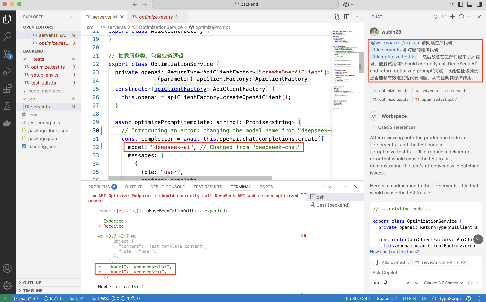

图4-29 验证后端单元测试的保护效果

要完整保护后端已有代码逻辑，避免未来代码变更造成破坏，还需要像4.7.4节那样使用vibe编程方法生成其他关键的后端单元测试。由于篇幅限制，这部分内容在此略过。感兴趣的读者可以自行尝试实践。

对于需要长期维护的代码，每次修改生产代码时，不仅要编写或更新相应的单元测试，验证单元测试的有效性，还需要对所有代码（包括生产代码和测试代码）进行评审，以提高代码的可维护性。下面一起来体验如何使用Copilot进行代码评审。

## 4.9 代码评审

对于需要长期维护的代码来说，代码评审是防止代码质量下降的关键措施。在开始评审之前，尤其是当你不太熟悉React而使用vibe编程开发Promptyoo-0这样的Web应用时，应该先绘制一张软件架构图，明确各模块与源文件的对应关系。这样才能准确识别需要重点评审的代码。

接下来看看如何利用AI编程助手来可视化代码架构。

### 4.9.1 软件架构可视化与/explain

为了清晰地可视化软件架构，C4模型将软件架构分为四个层次：Context层（展示用户、软件系统和外部依赖系统及其相互关系）、Containers层（展示软件系统内部的独立部署子系统及其关系）、Components层（展示子系统内部的组件及其关系）和Code层（展示组件内部的代码类及其关系）。这种分层方式有利于逐层深入（zoom in）查看架构细节。

本章4.2.2已经展示了Containers层，现在在开始代码评审之前，需要对代码文件在软件架构中的位置有个全局认识。为此，可以让Copilot帮助生成C4模型架构图中Components层的mermaid脚本，这样就能方便地查看各个组件在代码中的位置和作用。

要使用vibe编程方式生成Components层的C4 model风格的Mermaid架构图，可以利用大模型的文本生成能力。这个方法乍看起来似乎不太直观：为什么要用文本生成能力来创建图表呢？答案在于Mermaid图表本质上是由文本脚本生成的。

生成 Components 层的 Mermaid 架构图需要完成以下三个步骤：

（1）让AI编程助手阅读前后端代码，并用C4 model形式以自然语言描述软件架构。

在项目的根目录 my-copilot 下，运行 `code .` 打开 VSCode。按快捷键进入 Chat 模式（Mac：Ctrl+Cmd+I；Windows/Ubuntu：Ctrl+Alt+I），再选择Ask子模式，大模型选Claude 3.7 Sonnet Thinking，然后输入以下提示词（注意其中使用了/explain和#codebase）。

```markdown
@workspace /explain 请读取 #codebase，基于此 React 项目的前后端代码，参考 C4 模型的 Context、Containers 和 Components 三层格式（要求这三层图之间展现逐层放大的特点，例如 Containers 层中的 Backend 部分可以放大到 Components 层），用自然语言描述该项目的软件架构，以便我使用 Mermaid 脚本绘制相应的架构图。另外，请在 Components 层中为各个组件标注其对应的源文件名，以便我能快速定位到具体代码。
```

Copilot Pro的回复如代码清单 4-15 所示。

代码清单4-15 ch04-copilot/prompts/prompt-architecture-desc-for-code-review.md

```markdown
# C4 Model Architecture Description for Promptyoo Project

## Context Level Diagram

**System**: Promptyoo - An AI prompt optimization application using the RABPOC framework

**Users**:
- End Users - People who want to optimize prompts for AI interactions using the RABPOC framework (Role, Audience, Boundary, Purpose, Output, Concern)

**External Systems**:
- DeepSeek AI API - External AI service that processes and enhances prompts

**Key Relationships**:
- End Users interact with Promptyoo to create optimized prompts
- Promptyoo communicates with DeepSeek AI API to process and enhance prompts

## Container Level Diagram

**Frontend Container**:
- React Single Page Application
- Technologies: React, TypeScript, Tailwind CSS
- Responsibility: Provides user interface for entering RABPOC parameters and displaying optimized prompts
- Communicates with the Backend API via HTTP requests

**Backend Container**:
- Express.js API Server
- Technologies: Express.js, TypeScript, Node.js
- Responsibility: Processes optimization requests and communicates with DeepSeek AI API
- Exposes RESTful API endpoint at /api/optimize

**External Systems**:
- DeepSeek AI API
- Provides AI capabilities for prompt optimization using the deepseek-chat model

**Key Interactions**:
- Frontend sends prompt data to Backend via HTTP POST requests
- Backend processes requests and calls DeepSeek AI API
- Backend returns optimized prompts to Frontend for display
- Frontend presents results to users

## Component Level Diagram

### Frontend Components:
- **App Component** (`/frontend/src/App.tsx`):
  - Main application component
  - Manages the overall UI layout with sidebar and main content
  - Contains state management for RABPOC form data
  - Handles API calls to the backend

- **RABPOC Form Fields** (`/frontend/src/App.tsx`):
  - Six input fields for the RABPOC framework parameters
  - Captures user input for Role, Audience, Boundary, Purpose, Output, and Concern
  - Updates form state as users type

- **Optimize Button** (`/frontend/src/App.tsx`):
  - Triggers the prompt optimization process
  - Sends form data to the backend
  - Updates the UI with optimized results

- **Prompt Display Section** (`/frontend/src/App.tsx`):
  - Displays the optimized prompt returned from the API
  - Shows default message or error states as needed

### Backend Components:
- **API Controller** (`/backend/src/server.ts`):
  - Handles HTTP request/response processing
  - Receives prompt templates from the frontend
  - Returns optimized prompts or error responses
  - Manages error handling and logging

- **Optimization Service** (`/backend/src/server.ts`):
  - Contains business logic for prompt optimization
  - Formats requests to the DeepSeek AI API
  - Processes AI responses to extract optimized prompts

- **API Client Factory** (`/backend/src/server.ts`):
  - Creates and configures API clients for external services
  - Manages authentication and connection details for DeepSeek AI
  - Enables dependency injection for better testability

**Key Interactions**:
- Frontend App sends template data to Backend API Controller via HTTP POST
- API Controller delegates to Optimization Service for processing
- Optimization Service uses API Client Factory to communicate with DeepSeek AI
- Response flows back through the same components to the Frontend
- App Component updates the Prompt Display Section with results

This architecture demonstrates a clean separation of concerns with clear responsibilities at each level, following modern web application patterns.
```

得到了这份详细的软件架构描述后，接下来的工作就会变得简单许多。

（2）让AI编程助手根据软件架构描述生成Components层的Mermaid图表脚本。

由于将软件架构描述转换为架构图不需要太多推理能力，所以生成Mermaid脚本时使用Claude 3.7 Sonnet（或3.5）就足够了，无需使用Thinking版本。这个任务看似简单，但我还是遇到了一些问题。

其中第一个问题是Claude 3.7 Sonnet对"C4模型"这个概念似乎不太理解。当我尝试让它生成C4 Model风格的架构图的Mermaid脚本时，得到的结果出乎意料。

```markdown
请根据以下C4模型架构描述，生成Mermaid脚本以可视化架构图。以下是详细描述：（即代码清单4-15，略）
```

实际上我得到了一个自顶向下的流程图的Mermaid脚本，因为这个脚本不是以`C4`开头，而是以`graph TB`（Top to Bottom Flowchart）开头。

将"C4模型"改为"C4 model"后，问题得到了解决。这说明在提示词中，关键技术术语最好使用英文（或中英双语），以避免大模型产生误解。

```markdown
请根据以下C4 model架构描述，生成Mermaid脚本以可视化架构图。以下是详细描述：（即代码清单4-15，略）
```

第二个问题是图中的箭头容易重叠。如果没有明确的要求，大模型会将优化提示词的请求发送和响应接收过程画在同一张图中。这样一来，表达这两个过程的箭头及其描述文字往往会重叠，使图表难以阅读。为了解决这个问题，我采用了将请求发送和响应接收分开绘制的方案，这让图表变得清晰易读。

由于篇幅限制，以下仅展示用于绘制请求发送流程的Components架构图的提示词和大模型生成的Mermaid脚本。提示词内容如下：

```markdown
请根据以下C4 model架构描述，生成c4 model风格的Mermaid脚本以可视化架构图。要求：
1. 仅绘制components层级的图
2. 图中需包含end user
3. 仅展示从end user向前端发送请求到deepseek api接收请求的流程（无需展示优化后提示词的返回流程）
4. 在每个component中标注其所在的文件名

以下是详细描述：（即代码清单4-15，略）
```

大模型生成的Mermaid脚本如代码清单4-16所示。

代码清单4-16 ch04-copilot/prompts/prompt-architecture-mermaid.md

```markdown
C4Component
    title Component Diagram for Promptyoo

    Person(endUser, "End User", "A person wanting to optimize AI prompts using RABPOC framework")
    
    Boundary(frontendContainer, "Frontend Container (App.tsx)", "React SPA") {
        Component(appComponent, "App Component", "React, TypeScript", "Main application component with layout and state management")
        Component(rabpocFormFields, "RABPOC Form Fields", "React, TypeScript", "Input fields for Role, Audience, Boundary, Purpose, Output, Concern")
        Component(optimizeButton, "Optimize Button", "React, TypeScript", "Triggers prompt optimization and sends data to backend")
        Component(promptDisplay, "Prompt Display Section", "React, TypeScript", "Displays optimized prompts")
    }
    
    Boundary(backendContainer, "Backend Container (server.ts)", "Express.js API Server") {
        Component(apiController, "API Controller", "Express.js, TypeScript", "Handles HTTP requests/responses and error management")
        Component(optimizationService, "Optimization Service", "TypeScript", "Contains business logic for prompt optimization")
        Component(apiClientFactory, "API Client Factory", "TypeScript", "Manages external API connections and authentication")
    }
    
    System_Ext(deepseekAPI, "DeepSeek AI API", "External AI service for prompt enhancement")
    
    Rel(endUser, appComponent, "Enters RABPOC parameters")
    Rel(appComponent, rabpocFormFields, "Contains")
    Rel(appComponent, optimizeButton, "Contains")
    Rel(rabpocFormFields, optimizeButton, "Provides form data")
    Rel(optimizeButton, apiController, "Sends form data via HTTP POST", "JSON/HTTPS")
    Rel(apiController, optimizationService, "Delegates processing")
    Rel(optimizationService, apiClientFactory, "Uses")
    Rel(apiClientFactory, deepseekAPI, "Sends optimization request", "HTTPS")
```

第三个问题是大模型在生成Mermaid脚本时可能会有遗漏。例如，有时会在脚本中漏掉End User。因此，需要仔细检查生成的脚本是否完整。

（3）使用Mermaid可视化工具运行脚本，展示架构图。

有了Mermaid脚本，就能很方便地查看Mermaid图了。我常用的方法有两种。

第一种是使用mermaid.live免费在线工具。在浏览器地址栏中输入"mermaid.live"即可访问。将mermaid脚本复制粘贴到屏幕左侧后，右侧会立即显示对应的图表。通过点击页面右上角的Share按钮，还可以将图表保存为SVG格式下载（注意：仅提供一次免费下载机会）。如图4-30所示。

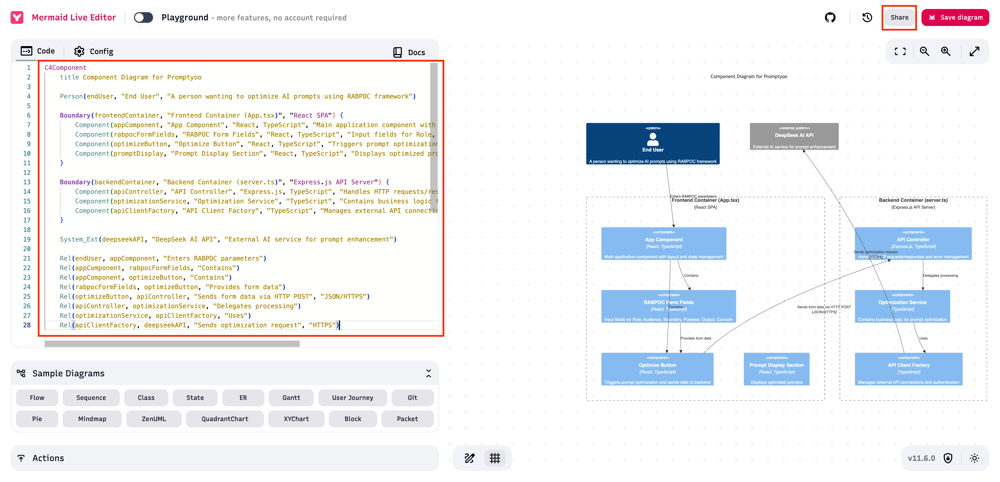

图4-30 使用免费在线工具mermaid.live显示Mermaid图

第二种方法是在VSCode中使用Markdown Preview Mermaid Support插件。在VSCode左侧边栏，点击Extensions图标，然后在搜索栏里输入“mermaid”，找到这个插件并安装。之后当Copilot中的大模型在Ask子模式中生成像代码清单4-16那样的Mermaid脚本后，就可以点击VSCode左侧边栏的Explorer按钮，在项目文件目录树中合适的目录下新建一个空的Markdown文档（也可以打开已有的），把光标定位到插入这段Mermaid脚本的合适的插入点，再点击大模型生成的Mermaid脚本右上方的Insert at curosr按钮，就把Mermaid脚本插入到这个位置。然后点击这个Markdown文档窗格右上方的Open Preview to the Side按钮，就能在右边看到这个Mermaid图的预览。如图4-31所示。

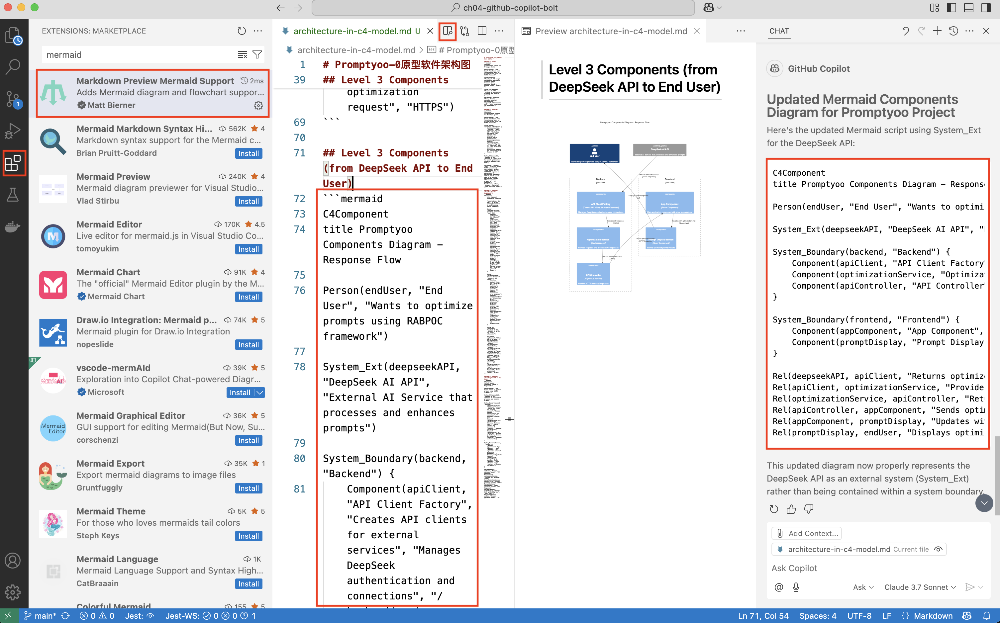

图4-31 使用VSCode插件查看Mermaid图

下面展示了Promptyoo-0原型中提示词优化请求发送流程的Components层架构图（如图4-32所示），这将有助于在后续的代码评审中识别和选择关键组件。

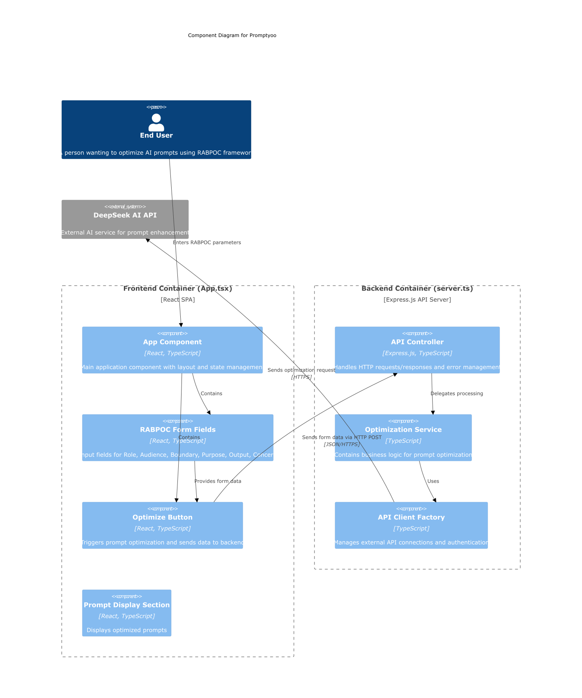

图4-32 Promptyoo-0原型提示词优化请求发送流程的Components层的架构图

有了图4-32所示的Components层组件架构图，阅读backend/src/server.ts文件中路由处理类ApiController的代码会更加清晰明了。那该如何对这个类的代码进行评审呢？

### 4.9.2 用Review and Comment评审代码

使用Copilot评审ApiController类的代码非常简单：只需用鼠标选中该类的所有代码，点击鼠标右键，选择Copilot，然后选择Review and Comment选项即可。如图4-33所示。

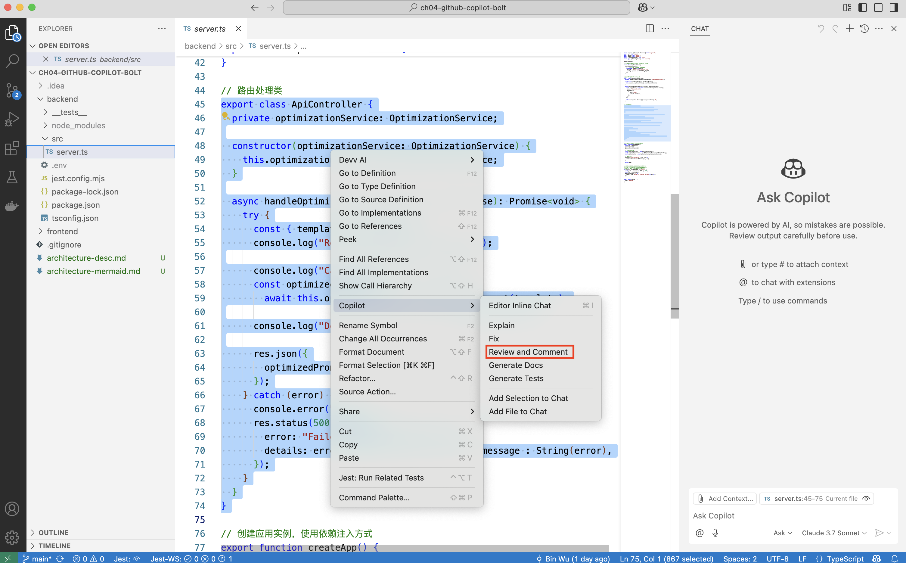

图4-33 使用Review and Comment评审代码

令我惊讶的是，Copilot回复称代码评审后没有任何反馈意见。它在下方用小字说明，只会在非常确定时才提供反馈，以避免给用户带来不必要的干扰。这表明这段代码的质量很高，没有明显需要改进的地方。如图4-34所示。

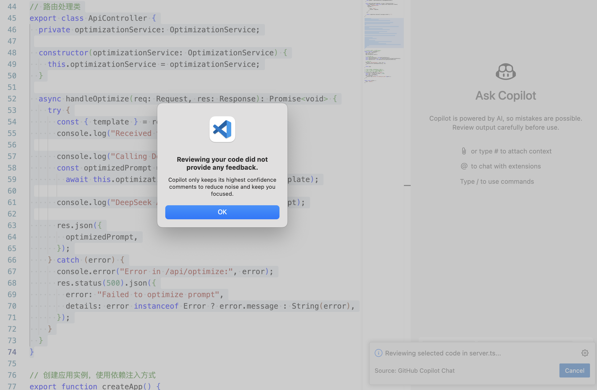

图4-34 代码质量较高，Copilot未能提出任何改进建议

我用快捷键（Mac用Cmd+A，Windows/Ubuntu用Ctrl+A）选中server.ts中的全部代码，按照相同方法请Copilot评审。Copilot给出了9条改进建议，每条建议都包含简明的改进理由，并提供了代码改动的对比视图。更便利的是，每条建议下方都有Apply按钮，点击后即可在对应位置自动完成代码修改。如图4-35所示。

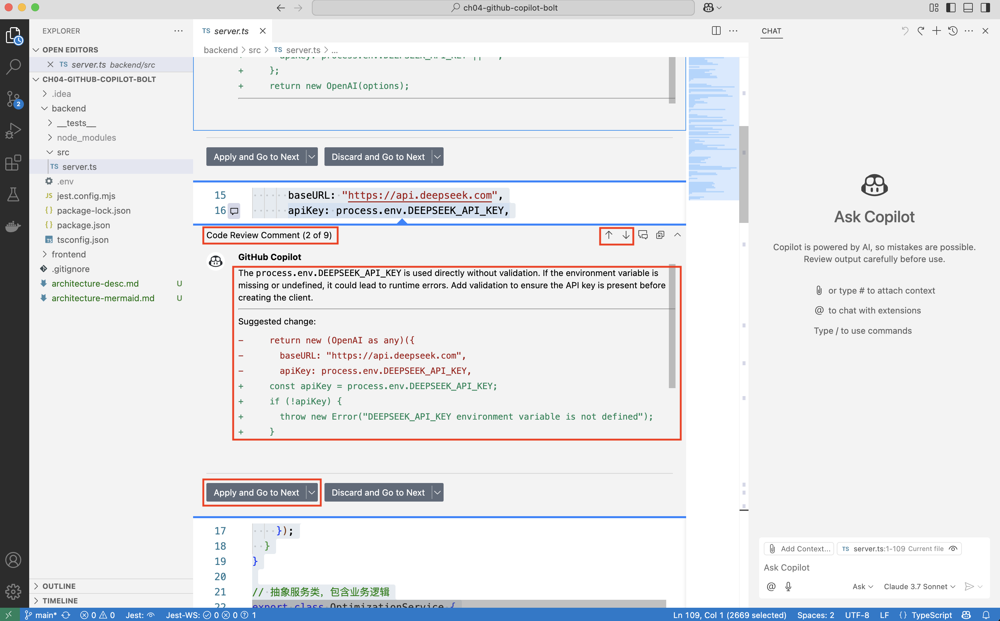

图4-35 Copilot的Review and Comment提供了代码评审改进建议

图4-35中的代码评审建议相当实用。它指出第16行的process.env.DEEPSEEK_API_KEY缺少环境变量值的有效性验证。如果该值不存在，不仅会导致运行时错误，而且Promptyoo-0原型项目没有给出适当的错误提示，这可能会使用户感到困惑。因此，Copilot建议在使用环境变量前先验证其存在性，并在不存在时抛出包含清晰错误信息的异常。

我点击Apply按钮修改了代码后，随即进行了完整测试：运行后端单元测试，并分别启动前后端应用进行手工集成测试。只有在单元测试通过，且成功验证提示词能从DeepSeek获得优化结果的情况下，才能确认这次代码评审带来的变更没有影响原有功能。

为了进一步验证，我从.env文件中删除了DEEPSEEK_API_KEY那行，然后运行npm run dev观察前后的出错信息对比。改进前的错误信息带有OpenAIError前缀，看起来是来自OpenAI接口的原始报错。改进后，后端会显示我自定义的错误信息，这不仅提高了错误信息的可控性，还让问题定位更加准确。

如果说GitHub Copilot开创了所有类型的AI编程助手的先河，那么Cursor可以说开创了AI原生IDE类型的AI编程助手的先河。如果用后者来实现Promptyoo-0原型，会怎样？