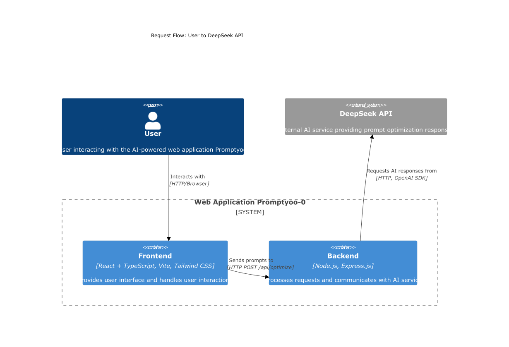
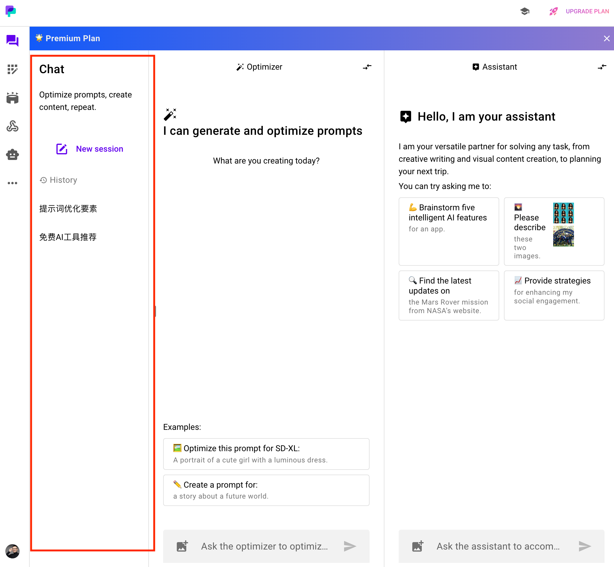
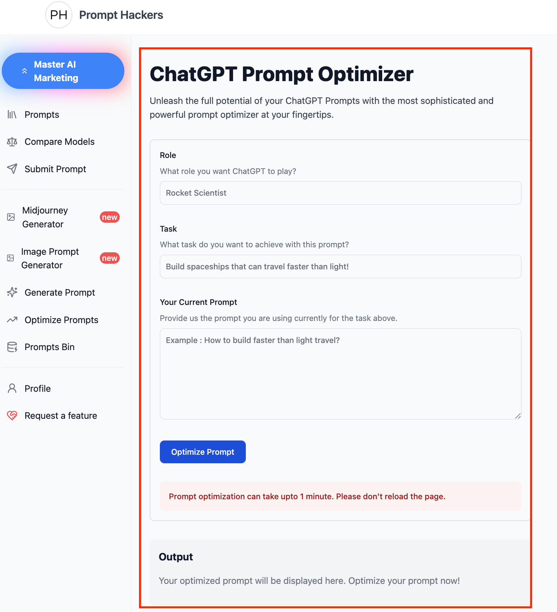
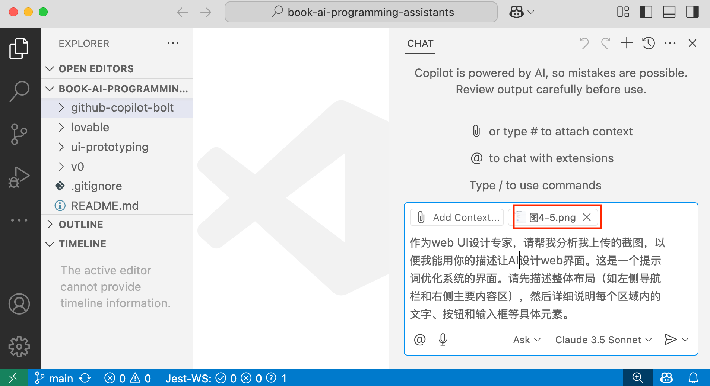
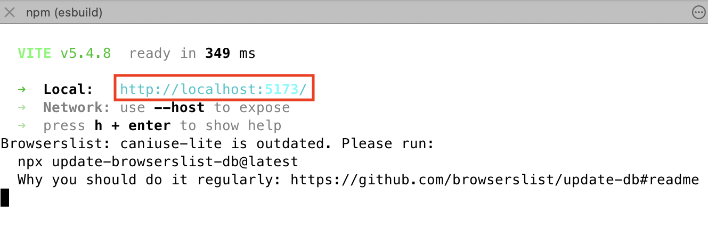
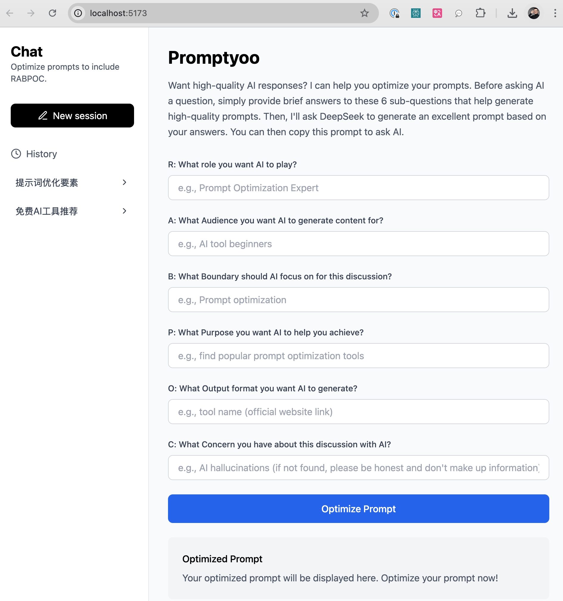
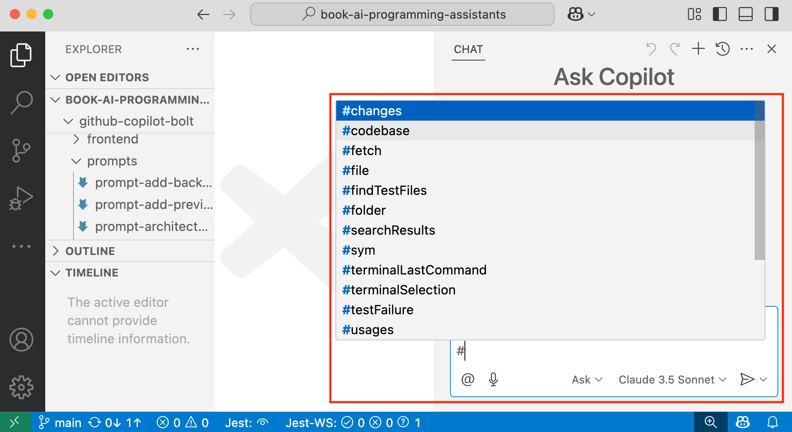
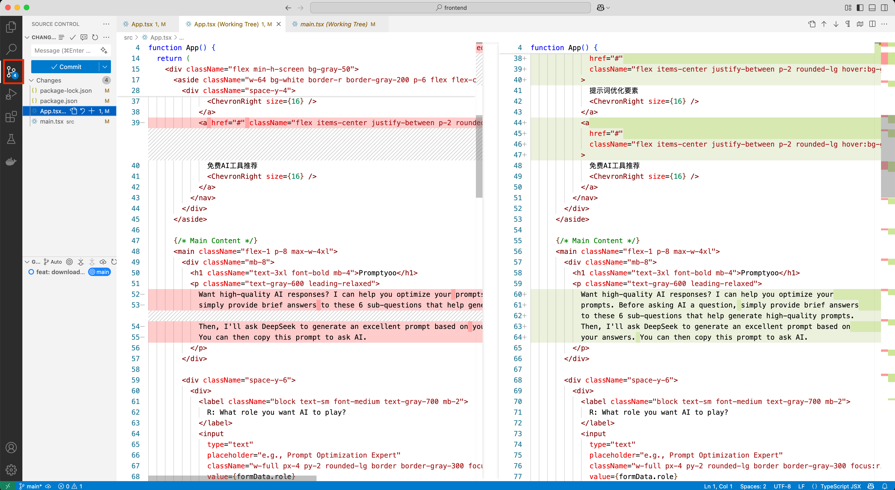

# 第4章 用GitHub Copilot实现Promptyoo-0原型

GitHub Copilot（以下简称Copilot）是一款革新性的AI编程工具。作为首个获得广泛应用的AI编程助手，它能帮助程序员自动生成和编写代码。这款由GitHub与OpenAI共同开发的工具开创了AI辅助编程的新纪元，并深刻影响了后续同类产品的发展。

Copilot的核心使命是简化并加速编程过程。它的主要功能包括自动补全代码、将自然语言转换为代码、生成新代码、提供代码解释以及实现跨编程语言转换。

Copilot的发展历程经历了多个重要阶段：最初源自2014年微软的Bing Code Search，随后在2021年6月于VS Code编辑器推出测试版，2022年6月转为付费服务，2023年底升级至GPT-4模型，到2024年引入了多AI模型选择功能，如GPT-4o或Claude 3.5 Sonnet。

从技术角度看，Copilot最初采用专为编程设计的OpenAI Codex模型。该模型通过分析海量代码（含159GB的Python代码）来理解各类编程语言。随后，Copilot升级到GPT-4，并允许用户自主选择AI模型。

然而，Copilot仍面临两大挑战：首先是版权争议，即使用开源代码训练的合法性存在争议；其次是安全隐患，由于需要网络连接，存在代码泄露风险。

自2024年12月18日起，Copilot推出了免费服务计划（此前个人用户需每月支付10美元订阅Pro服务）。免费服务每月提供2,000次代码补全和50条聊天消息的使用额度，足以满足编程需求较少的用户。这是GitHub首次为普通个人开发者提供完全免费的Copilot体验，无需试用期，也无需绑定信用卡。

接下来，我将通过实战项目来展示Copilot的功能：开发Promptyoo-0（读作"颇优零"）原型。我会采用vibe编程方法，即让AI来编写所有的代码，以此检验Copilot的各项特性。

<aside>
💡

【避坑指南】为何不用DeepSeek和Claude这些网页端AI助手开发Web应用？

答案是虽然可以用，但操作起来很麻烦。因为Promptyoo-0原型这种Web应用，包含多个文件。网页端AI编程助手虽然能在单次对话中生成这些文件，但一旦开启新对话，它就会遗忘之前的内容。如果每次都要重新上传这么多文件，会非常繁琐。相比之下，在IDE（Integrated Development Environment，集成开发环境）中使用AI助手就方便多了，因为代码就存在IDE里，你向AI提问时可以直接引用它们。

</aside>

## 4.1 需求分析

本章我将开发一个名为Promptyoo的网页应用，这是一个提示词优化工具。通过这个项目，可以体验不同AI编程助手的功能。

为什么要做这个项目？因为提示词的质量对AI来说非常重要：它决定了AI输出的内容质量，也决定了AI能生成什么样的代码。做这个项目不仅能学会使用AI工具，还能有助于写出更好的提示词，从而让AI给出更准确的回答。

Promptyoo分为两个版本：Promptyoo-0和Promptyoo-1（后者会在第5章介绍）。先来看Promptyoo-0。这是一个简单的网页端应用，它的特点是通过让用户回答下面6个简单问题来生成高质量的提示词，以获取更高质量的AI回答。

- **R**（Role）：你期望AI扮演什么角色（如"提示词优化专家"）？
- **A**（Audience）：你期望AI面向哪些目标受众（如"AI工具初学者"）回答问题？
- **B**（Boundary）：你想与AI讨论哪个知识领域（如"提示词优化"）的问题？
- **P**（Purpose）：你向AI提问后想要达到什么目标（如"寻找热门提示词优化工具"）？
- **O**（Output）：你希望AI以什么格式（如"工具名称+官网链接"）输出回答？
- **C**（Concern）：你在与AI交互时有什么顾虑（如"担心AI产生幻觉"）？

名字中的"-0"就是表示"从零开始"的意思，就是说当你想问AI，但不知道该如何提问时，只要在网页上回答上面这6个问题，系统就会调用DeepSeek API生成一个优质的提示词，帮你获得更好的AI回答。

由于本书的重点在于体验AI编程助手，而非开发完整产品，这个网页应用的功能会相对简单。第一阶段只需实现一个原型，让它能通过DeepSeek API获取优化后的提示词，并在本地电脑运行。至于提示词历史对话浏览和i18n国际化功能，会在本书后续章节中实现。

明确了需求，接下来看看这个原型的软件架构该如何设计。

## 4.2 架构设计与Ask子模式

软件架构设计为何要在编码之前？这个问题让我联想到盖房子的道理。就像人们不会直接买材料开始建造，而是先绘制设计图一样，软件开发也需要先有整体规划。软件架构就像房子的设计图纸，是程序的整体规划蓝图。

软件架构主要规划三个方面：如何组织各个部分（就像规划房子的客厅和卧室布局），各部分如何互相配合（类似设计房间之间的连接方式），以及每部分负责做什么（如同规划每个房间的用途）。

如果跳过架构设计直接开始编码，可能会遇到一些麻烦：写到一半发现设计有误需要重新开始，代码结构混乱难以修改，以及新功能难以添加。

### 4.2.1 前后端分离的架构

在本项目中，我采用现代Web应用开发中常见的前端和后端分离的设计方式。这种设计很像一家餐厅：前端就像顾客看到的就餐区，后端则如同后厨。具体来说，前端是用户可以看到和使用的界面（如网页），而后端则是在背后处理数据的部分，虽然用户看不到但至关重要。

这种分离设计带来诸多好处：开发团队可以更好地协作，就像厨师和服务员能同时工作；系统更容易改进，因为修改网页样式不会影响后台功能；能够支持多种设备，同一个后端系统可以支持网页、手机等多种界面；让开发者各自专注于自己的领域；问题定位更加容易，能快速判断是前端还是后端的问题；同时也更加安全，因为重要的数据处理都在后端完成。

<aside>
💡

【避坑指南】能否把所有功能都放在前端实现？这样不是更简单吗？

这样做会带来严重问题。设想一下，如果餐厅没有厨房，所有顾客都要自己做饭，会是什么情况？把所有功能都放在前端也是类似的情况。

首先是安全问题。前端代码在用户设备上运行，人人都能看到和修改，这就像把密码贴在保险箱上、把银行卡密码公开在外，或是把钥匙挂在门外一样危险。在本项目中，访问DeepSeek API的密钥也必须保密，否则他人获取后可能擅自使用你购买的DeepSeek token，导致经济损失。更严重的是，用户甚至可能篡改前端数据，比如把100元的商品价格改成1元！

其次是运行效果不稳定。这就像让顾客自己做饭：有人设备性能好，运行快速；有人设备性能差，运行缓慢。这会导致高端手机上运行流畅，普通手机可能卡顿，用户体验难以保证。

数据一致性也是个问题。当多人同时使用时，每个用户看到的数据可能不一致，并发修改同一数据会产生冲突，就像多个厨师各自烹饪同一道菜，成品各不相同。

更新维护同样困难。当程序需要修复问题时，必须等待所有用户更新，使用旧版本的用户仍在运行有问题的程序，就像更新了菜谱，但并非所有厨师都知晓。

核心功能也容易被复制。你的核心功能对公司而言极其重要，但放在前端就等于公开源码，竞争对手可以轻易复制，这就像公开可口可乐的配方一样危险。

最后，与其他系统对接也会遇到困难。许多功能需要连接外部系统，比如支付系统密钥、短信服务密钥等，这些敏感信息都不能放在前端。

</aside>

### 4.2.2 用Ask子模式获取架构建议

如果你不太熟悉Web应用开发的前后端技术栈，可以使用Copilot的Ask子模式，通过编写提示词向其支持的大模型寻求建议。

GitHub Copilot的Chat模式是一项集成在VS Code中的智能对话功能，让开发者能通过自然语言来理解代码、调试问题或编辑多个文件。它提供三种子模式（本文基于VSCode 1.99.3版本和Copilot 1.303.0版本，如果你使用较低版本，请参考附录1.2和附录4.1进行升级）：

首先是Ask问答模式。该模式专注于解答代码相关问题，涵盖代码解释、技术概念和设计思路等。其最大优势在于能快速获取技术建议，尤其适合学习和理解代码逻辑。一个重要特点是AI不会擅自修改代码，这确保了代码安全性。然而，这也意味着一定的局限性：要修改代码必须手动点击相应按钮，无法实现AI自动修改。这种模式最适合三种场景：理解代码（如查询身份验证中间件的工作原理）、学习新技术（如探索Rust的所有权机制），以及在AI修改代码前进行人工确认。

其次是Edit编辑模式。该模式可以根据自然语言指令直接修改代码，并支持跨文件操作。其优势在于能自动化实现代码变更（不过在变更生效前，系统会提供代码对比视图以及确认或回退按钮），例如重构代码或修复Bug，从而提升开发效率。使用这种模式的前提是，你需要明确知道要修改哪些代码文件，并将它们添加到上下文中。当你清楚地知道需要在哪里修改代码时，这种模式特别适合快速实现功能（比如在用户模型中添加邮箱验证字段）或修复错误（如修正循环中的空引用异常）。

最后是Agent代理模式（截至本章撰写时，该功能在Mac、Windows11（以下简称Windows）和Ubuntu24（以下简称Ubuntu）版本的VSCode+Copilot上可用，但Windows10版本并不支持，或许与微软即将停止支持Windows10有关）。这种模式能自主完成高层次开发任务，如搭建新功能或项目，并能调用工具链和迭代解决问题。它的优势是能减少人工干预，特别适合处理复杂任务，还能自动处理依赖和错误。但它需要明确的需求描述，可能需要后续调整，而且对于简单任务可能显得过于复杂。这种模式适合从零开始实现功能（如创建支持JWT的登录API）或处理多步骤任务（如优化前端性能并生成报告）。

如果你还未在VSCode中安装和使用Copilot插件，可以先暂停阅读，参考附录4.1完成插件的安装和功能验证。完成后再返回此处继续阅读。

要在Copilot的Ask子模式中编写的提示词如代码清单4-1所示。

代码清单4-1 ch04-copilot/prompts/prompt-architectures-for-frontend-and-backend-separation.md

```markdown
你是资深的Web应用开发专家，我是Web开发新手。请你阅读后面的需求，并为我推荐3种软件架构方案。要求这3个方案都是前后端分离的模式，且都包含过去1～2年中Web开发领域最流行的技术栈，并详细对比这些方案的优缺点及其最佳应用场景。具体需求如下：（后面内容摘自4.1需求分析，略）
```

为了节省篇幅，对于提示词中出现的本书已有内容，会略去。完整的提示词及AI编程助手的回复请参见代码清单编号后所注明的相关文件。

要想在Copilot里获取大模型对于架构设计的建议，可以使用Copilot的Chat模式下的Ask子模式，如图4-1所示。


图4-1 使用Ask子模式咨询大模型

进入Ask子模式的具体步骤如下。

（1）创建项目目录：在终端运行以下命令，在个人目录下创建名为"my-copilot"的空目录，作为本章项目实战的根目录。

```bash
# 进入个人根目录
cd

# 新建项目目录
mkdir my-copilot

# 进入项目目录
cd my-copilot
```

（2）用VSCode打开项目（后文默认都已用VSCode打开项目，不再赘述）：执行以下命令打开项目，注意末尾要加上小数点以表示当前目录。

```bash
code .
```

（3）进入Chat模式：点击Copilot右上角的Toggle Secondary Side Bar按钮打开Chat模式（鼠标悬停在按钮上可显示按钮名称；或者使用下面列出的Chat快捷键或Toggle Secondary Side Bar快捷键）。再次点击此按钮或按快捷键即可关闭Chat模式。

<aside>
💡

【Chat快捷键】

Mac：Ctrl+Cmd+I

Windows/Ubuntu：Ctrl+Alt+I

【Toggle Secondary Side Bar快捷键】

Mac：Opt+Cmd+B

Windows/Ubuntu：Ctrl+Alt+B

</aside>

（4）选择Ask子模式：在Ask Copilot输入框下方，点击按钮切换至Ask子模式。

（5）选择大模型：点击Ask子模式按钮右侧的大模型名称（默认是GPT-4o）按钮来切换咨询的大模型。确认选择了Claude 3.5 Sonnet（因为这款大模型编程能力出众）。

（6）输入提示词：将代码清单4-1中的完整提示词复制并粘贴到Ask Copilot输入框中。

（7）提交：在Ask Copilot输入框中按回车键提交提示词。Copilot会将提示词转发给所选的大模型处理，稍后你就能看到大模型的回复。

<aside>
💡

【避坑指南】该选哪款大模型？

点击图4-1中的Claude 3.5 Sonnet按钮后，Copilot会显示可选择的5种大模型：Claude 3.5 Sonnet、Gemini 2.0 Flash、GPT-4.1 (Preview)、GPT-4o和o3-mini。其中前4种模型适合快速编程，而o3-mini则更适合推理和规划任务。根据我在撰写本书时积累的实践经验，在编程能力方面，Claude 3.5 Sonnet的表现明显优于其他4种模型，因此在编写代码时本书将默认使用它。

</aside>

根据代码清单4-1中的提示词，Ask子模式为我推荐了三种架构方案。由于AI能够详细解释当前流行的技术栈，因此在学习过程中选择架构时，可以优先考虑使用最热门的方案（这些方案在AI训练数据中有丰富的资料），即使对这些技术不太熟悉也无妨（因为不懂可以问AI）。在三个方案中，我选择了第一个：React + Express + MongoDB。不过，考虑到目前还处于原型开发阶段，暂时不需要数据持久化功能，所以可以先不使用MongoDB。

如果用C4 model（一种近来流行的架构可视化方法）架构图来可视化（用AI生成C4 model风格的架构图参见4.9.1）这个架构，那么就如图4-2所示。



图4-2 Promptyoo-0前后端分离架构图（请求发送）

图4-2展示了Promptyoo-0应用程序的请求发送过程，展现了从用户到DeepSeek API的完整路径。有助于了解这个架构的核心组成部分。

在这个系统中，终端用户与AI驱动的网络应用程序Promptyoo-0交互。Web应用分为两个主要部分：前端使用React、TypeScript、Vite和Tailwind CSS技术栈，负责用户界面与交互；后端采用Node.js和Express.js，处理请求并对接AI服务。此外，系统还依赖一个关键的外部组件：DeepSeek API，它提供提示词优化服务。

整个请求流程简洁明了：用户通过浏览器与前端交互，前端将提示词通过HTTP POST请求发送至"/api/optimize"端点，后端则通过HTTP和OpenAI SDK与DeepSeek API通信。这构成了一个完整的请求链路，从用户输入直至获取优化后的提示词。

明确了架构后，接下来就要进行任务拆解（tasking）了。

## 4.3 任务拆解

在开始使用vibe编程方法之前，为什么要先拆解任务呢？难道不能直接把已确定的需求描述和架构设计交给AI编程助手，让它一次性生成完整的可运行系统吗？

这确实是个好问题。虽然AI编程助手确实能够直接从需求和架构描述生成代码，但这种做法很可能会导致系统运行出错。这是因为Promptyoo-0原型需要运行在我的本地电脑上，而AI并不了解我电脑上的具体依赖库版本。它只能基于猜测来生成代码，而这些猜测可能是错误的。即使系统能够运行，某些功能可能也无法满足预期，因为前期给出的需求和架构描述往往过于笼统。我真正想要的系统细节还没有向AI说明清楚。

要解决这个问题，我需要先拆解任务，再逐个深入讨论。这种方式不仅有助于理清思路和避免遗漏关键功能，还能让AI在有限的对话上下文中专注处理单个任务，从而产出更高质量的代码。

作为一本专注于使用AI编程助手进行vibe编程的书，我们也可以让AI来协助任务拆解。我使用了以下提示词（包含前两节中的需求描述和架构设计要点），先是咨询了Copilot Pro（使用Claude 3.7 Sonnet大模型），然后又咨询了Claude官网（选用Claude 3.7 Sonnet大模型，并启用Extended thinking和Web search功能，这是因为vibe coding作为2025年新出现的术语需要额外的搜索支持）。

```markdown
作为精通任务拆解和vibe coding的开发者，请针对我这位web开发新手后面提供的Promptyoo-0原型web应用的需求描述和架构设计，使用2025年Web开发与vibe coding最佳实践来拆解任务，帮助我顺利完成这个原型的开发。请按照最佳实践推荐的顺序排列这些任务，并确保每个任务都足够小且可执行。下面是需求描述：（略）。下面是架构设计：（略）。
```

在分析了两个AI编程助手的答复后，我发现它们主要依据传统的编程最佳实践，而没有采用vibe编程方法。以Claude官网为例，它在前端界面开发中提出了四个子任务：创建核心组件、实现提示词表单组件、设计结果展示区域和实现响应式设计。这种拆分方式显然没有考虑vibe编程的特点，因为使用vibe编程时，这些任务只需"【用AI】根据界面文字描述直接生成前端代码"一步即可完成。尽管Claude官网启用了Web search功能可以检索最新技术文章，但它对vibe编程的理解仍然很浅显，只停留在一些表面的建议上，比如设计清晰的提示词、建立迭代反馈循环、确保人类参与、采用组件化模块化设计以及注重用户体验等泛泛而谈的内容。

这并不令人意外，因为大模型的训练数据尚未包含vibe编程相关内容。因此，我决定亲自动手，列出使用vibe编程实现Promptyoo-0原型的任务拆解清单（从【用AI】标记可以看出，我在其中大量运用了AI的协助）。

（1）生成并修改用户界面文字描述

【人工】拼凑用户界面

【用AI】为拼凑界面生成文字描述

【人工】修改界面文字描述以满足需求

（2）生成React前端代码

【用AI】根据界面文字描述直接生成前端代码

【人工】在本地电脑运行前端应用

【用AI】协助我看懂前端代码

（3）生成Node.js后端代码

【用AI】修改前端代码以备好发给后端的提示词

【用AI】生成后端代码

【用AI】修复运行错误

【用AI】修复功能异常

（4）前端单元测试

【用AI】搭建前端测试框架

【用AI】让第一个前端单元测试运行通过

【用AI】验证前端单元测试的保护效果

【用AI】补充其他关键的前端单元测试

（5）后端单元测试

【用AI】搭建后端测试框架

【用AI】让第一个后端单元测试运行通过

【用AI】验证后端单元测试的保护效果

【用AI】补充其他关键的后端单元测试

（6）代码评审

【用AI】可视化软件架构与代码对应关系

【用AI】评审并改进代码

接下来的章节内容将按照上述任务拆解逐步展开。首先来看看如何生成并修改用户界面文字描述。

## 4.4 用户界面与Vision

即使你没有从事过前端界面设计，也一定听说过Photoshop这个响亮的名字。"P图"这个广为流传的说法就充分体现了它的影响力。在2016年之前，Photoshop一直是用户界面设计的主流工具。

2016年9月，Figma的发布让这一格局发生了转变。这款被誉为"浏览器中的Photoshop"的工具凭借其独特优势——支持多位设计师在浏览器中实时协作的功能，逐步在用户界面和用户体验设计领域取代了Photoshop的地位。

到了2025年1月，当StackBlitz公司将其AI产品更名为bolt.new（详见下节）后，一个类似的转折点出现了："使用自然语言驱动AI直接编写原型代码，比用Figma绘制原型更高效"。这种方式完全省去了使用Figma绘制原型图的时间。

作为一本介绍AI工具的书，本书也将运用AI来设计用户界面。首先，我会准备描述界面的提示词，然后利用bolt.new这样的AI编程助手，将这些提示词转化为前端原型代码。

<aside>
💡

【避坑指南】为何不用Copilot生成前端代码？

答案是可以用，但用户体验远不如bolt.new。我曾尝试在Copilot的Agent子模式下用自然语言描述生成前端代码。然而，即使提示词中明确要求"左右分屏"的界面，生成的代码却显示为上下分屏，而且时钟图标异常巨大。即便请求修复三次，这些问题依然存在。我还在Ask子模式下用`/new`尝试创建新的前端项目，但运行时却遇到了"Build Error. Failed to compile. Next.js (14.2.28) is outdated (learn more)"的错误。最后改用bolt.new来生成前端代码，每次都能完美完成任务。

</aside>

### 4.4.1 拼凑用户界面

如何用文字描述Promptyoo-0的用户界面呢？对许多人来说，写作本就不是强项，更别说描述用户界面了。不过，现在大家都有了AI这个得力助手。我可以参考现有的提示词优化工具界面，选取合适的部分进行截屏，然后用PPT将这些截屏拼接起来。之后，让AI为我把这个拼接好的界面转换成文字描述。

有人可能会问："这种拼接的界面中肯定有需要调整的文字和图像，难道还要去P图吗？太麻烦了吧。"其实不用担心。我可以先让AI描述这个未经完善的界面，然后只需修改AI生成的文字描述即可。这样做不是比修图更简单吗？也比在Figma中从头设计原型要省力得多。

在浏览并测试了AI推荐的几款提示词优化工具后，我相中了promptperfect.jina.ai的左侧边栏界面（如图4-3所示）。



图4-3 promptperfect.jina.ai的左侧边栏界面

同时，我也喜欢prompthackers.co/chatgpt-prompt-optimizer的右侧提示词输入区设计。虽然它的提示词输入框数量不够，但我可以在后期添加（如图4-4所示）。



图4-4 prompthackers.co/chatgpt-prompt-optimizer的右侧提示词输入区

我在PPT中将这两个部分组合成了一个完整的用户界面，如图4-5所示。


图4-5 拼凑成的用户界面

### 4.4.2 为拼凑界面生成文字描述

图4-5中左侧边栏中"Chat"部分的文字描述需要修改。右侧提示词输入区域也需要调整，将当前的3个输入框扩展为6个，并更新标题和说明文字。不过正如前面提到的，不必急于修改图片本身。先用Copilot生成这张图的文字描述，之后再进行必要的调整。

要让Copilot识别图4-5，可以使用Copilot的Vision功能。Vision功能允许在与大模型对话时加入图片内容。最简单的方法就是用鼠标将图4-5文件拖拽到Copilot右下方的提示词输入区，作为对话的上下文，如图4-6所示。



图4-6 Vision功能允许在与大模型对话时加入图片内容

添加图片后，在提示词输入区输入提示词（如代码清单4-2所示），然后按回车键，让Copilot生成这张图片的文字描述。

代码清单4-2 ch04-copilot/prompts/prompt-stitch-ui-protytype.md

```markdown
作为web UI设计专家，请帮我分析我上传的截图，以便我能用你的描述让github copilot设计web界面。这是一个提示词优化系统的界面。请先描述整体布局（如左侧导航栏和右侧主要内容区），然后详细说明每个区域内的文字、按钮和输入框等具体元素。
```

当Copilot生成用户界面文字描述后，可以将这些描述保存到另一个文件中，并根据Promptyoo-0原型的需求修改文字内容。然后，在修改好的界面描述前添加一条提示词，就可以将其发送给bolt.new来生成前端代码了。完整的提示词如代码清单4-3所示。

代码清单4-3 ch04-copilot/prompts/prompt-generate-web-ui-by-github-copilot.md

```markdown
你作为web UI专家，请以2025年最流行的web开发前端框架和相关技术栈的最佳实践，按照下面的描述生成一个AI提示词优化的web app的UI界面：

### Overall Layout
The interface follows a two-column layout:

1. **Left Sidebar**:
- Logo/Brand section with "Chat" text and subtitle
- "New session" button with a pen icon
- "History" section with clock icon
- Two history items in Chinese characters

2. **Main Content Area (Right)**:
- Header with "Promptyoo" title
- Descriptive subtitle text
- Form sections for prompt optimization

### Detailed Components

#### Left Sidebar
- Brand section:
  - "Chat" in large text
  - Subtitle: "Optimize prompts to include RABPOC."
- Black in bold "New session" button with pen icon
- History section with grey clock icon
- Two navigation items in Chinese
  - “提示词优化要素”
  - “免费AI工具推荐”

#### Main Content Area
1. **Header Section**:
   - Title: "Promptyoo"
   - Subtitle: "Want high-quality AI responses? I can help you optimize your prompts. Before asking AI a question, simply provide brief answers to these 6 sub-questions that help generate high-quality prompts. Then, I'll ask DeepSeek to generate an excellent prompt based on your answers. You can then copy this prompt to ask AI."

2. **Input Form**:
   - **Role Section**:
     - Label: "R: What role you want AI to play?"
     - Text input field with "Prompt Optimization Expert" as example
   
   - **Audience Section**:
     - Label: "A: What Audience you want AI to generate content for?"
     - Text input field with "AI tool beginners" as example
   
   - **Boundary Section**:
     - Label: "B: What Boundary should AI focus on for this discussion?"
     - Text input field with "Prompt optimization" as example

   - **Purpose Section**:
     - Label: "P: What Purpose you want AI to help you achieve?"
     - Text input field with "find popular prompt optimization tools" as example

   - **Output Section**:
     - Label: "O: What Output format you want AI to generate?"
     - Text input field with "tool name (official website link)" as example

   - **Concern Section**:
     - Label: "C: What Concern you have about this discussion with AI?"
     - Text input field with "AI hallucinations (if not found, please be honest and don't make up information)" as example

3. **Action Area**:
   - Blue "Optimize Prompt" button

4. **Output Section**:
   - Gray background section
   - Label: "Optimized Prompt"
   - Helper text: "Your optimized prompt will be displayed here. Optimize your prompt now!"
```

从代码清单4-3可以看出，这段文字描述已将标题和内容更新为Promptyoo应用相关的内容，并且把提示词输入框扩展到了6个。

<aside>
💡

【避坑指南】为什么代码清单4-3中的用户界面描述用英文而不是中文？

虽然你可以在提示词中要求AI用中文生成描述，但我觉得用英文更为便利。原因在于，当让AI根据这段描述生成前端代码时，代码中的变量名一般还是使用英文——比如"角色"在代码中就得写作"role"。用英文描述可以避免在阅读代码和界面时频繁在中英文之间切换，让整个开发过程更加流畅。

</aside>

### 4.4.3 用RABPOC生成高质量提示词

请注意代码清单4-3开头的那句"你作为web UI专家"，这正是让AI扮演特定角色的实践，也就是运用了RABPOC六要素中的第一个Role。通过明确角色定位，AI能始终保持一致的对话风格和专业视角。根据我的实践经验，当你在编写提示词时把Role和其他五个要素都清晰地表达出来，AI的回复质量必然会有显著提升。

**Role（角色）：**你希望AI扮演什么角色？，比如"提示词优化专家"。

**Audience（受众）：**你希望AI为哪类受众生成内容？比如"AI工具初学者"。

**Boundary（边界）：**你希望与AI在哪个知识边界内进行讨论？比如"提示词优化"。

**Purpose（目的）：**你希望AI帮你实现什么目的？"寻找流行的提示词优化工具"。

**Output（输出部分）：**你希望AI生成什么格式的输出？比如"工具名称（官方网站链接）"。

**Concern（顾虑部分）：**你对这次与AI的讨论有什么顾虑？比如"AI幻觉（如果找不到相关信息，请诚实告知而不要编造信息）"。

如果将以上六个要素及其示例输入给AI，让它生成一个完整的提示词，结果可能如下：

> "请作为提示词优化专家，帮助AI初学者了解流行且可靠的提示词优化工具。提供一份专门用于提示词优化的知名工具清单，确保每个条目都包含工具名称及其官方网站链接。只收录在AI社区中经过验证且广受认可的工具，以避免AI产生幻觉。如果不存在此类工具，请诚实告知而不要编造信息。"
> 

<aside>
💡

【避坑指南】使用简单的“一句话提示词”有何不好？

与简单地说"给我一份提示词优化工具清单"相比，使用包含这六个要素的完整提示词会让AI给出更符合需求的回答。可以做个实验：先用你常用的AI聊天工具，在新对话中输入完整的六要素提示词，观察AI的回复。接着再开启新对话（不要在原对话中继续，因为AI会受之前提示词的影响），只用简单的一句话提示词，对比两次回复。我的实验表明，使用简单提示词时，AI往往会推荐一些面向高级用户的工具，这与我作为AI初学者的需求并不相符。

</aside>

## 4.5 用bolt生成React前端代码

Bolt.new是一个基于浏览器的网页开发工具，面向两类用户：追求效率的程序员和想建网站但编程经验有限的普通用户。

只需通过文字描述你想要的网站，Bolt.new就能自动生成代码。你可以直接在浏览器中编辑这些代码，无需复杂配置就能快速搭建基础网站。

Bolt.new支持Astro、Next.js、Vue等主流开发框架，并提供完整的开发环境。你可以在浏览器中添加功能模块、连接数据库，无需切换到其他工具。

从效率角度看，Bolt.new能显著缩短开发周期。传统方式需要2-3个月、花费数千美元的项目，现在两周内就能完成，成本仅为原来的几个百分点。

这款工具特别适合快速验证想法。它让用户能迅速将构想转化为实用网站，即使不懂编程也能轻松使用。操作简单，描述需求后几秒钟就能生成基础框架。对新手非常友好，无论是学习新技术的开发者还是想建网站的普通用户都能快速上手。发布过程也很便捷，一键点击即可让网站上线供人访问。

不过，Bolt.new目前主要适用于简单项目。复杂项目可能会遇到诸多限制，不太实用。大型或正式项目仍需采用传统开发方式。此外，使用成本可能较高，因为每次AI生成代码都需消耗token（需付费购买）。复杂项目可能会迅速耗尽积分，即使每月20美元可获得1000万token，对大型项目来说可能仍然不够。

因此，Bolt.new最适合用于快速搭建简单网站、验证新想法、学习新技术和制作演示项目。但开发复杂的正式网站时，可能需要结合传统开发方式。

由于bolt.new在生成前端代码方面表现出色，我使用它来将代码清单4-3中的提示词转换为实际代码。bolt.new不仅提供代码的查看、修改和下载功能，还支持实时的前端界面预览。

生成前端代码后的预览如图4-7所示。


图4-7 预览bolt.new根据提示词所生成的前端代码

查看和修改生成的前端代码如图4-8所示。


图4-8 查看和修改bolt.new根据提示词所生成的前端代码

值得注意的是，我在4.2.2中选择了React作为前端技术栈，因此本可以在代码清单4-3的第一句"2025年最流行的"后面明确指定"React"。虽然当时没有特别说明，但bolt.new仍然默认选择了React来生成代码，这恰好印证了React的主流地位。

生成前端代码后，点击图4-8右上角的"Export"按钮并选择Download下载代码zip包。

如果你以前没有通过浏览器下载并解压zip代码包到个人目录，可以先暂停阅读，参考附录4.2完成这些操作。完成后再回到这里继续阅读。

下载完成后，检查浏览器保存zip包的位置（通常在个人目录的Downloads目录中）。然后将zip包移动到之前创建的项目目录my-copilot下并解压，然后将解压后的目录重命名为"frontend"，以表明这是前端代码。

最后运行下面的命令用VSCode在my-copilot目录下（注意不是在frontend目录下，因为之后还要让Copilot创建backend目录）打开项目，就可以开始使用Copilot来修改前端代码或添加后端代码了。

```bash
cd ~/my-copilot
code .
```

在继续使用VSCode编写代码之前，需要在本地命令行终端运行前端代码，以验证bolt.new生成的代码能否正常运行。

<aside>
💡

【避坑指南】为何像bolt.new这样的Web应用AI编程助手所生成的代码要在本地运行？

因为4.1需求分析已经明确要求Promptyoo原型Web应用“在本地电脑运行”。虽然图4-7显示代码在bolt.new云平台上运行良好，但在本地环境中不一定如此。这是因为bolt.new生成的前端代码依赖于特定版本的JavaScript库。这些代码在bolt.new的云平台上运行正常，因为已经过工程师测试。

但本地环境可能缺少这些特定版本的依赖库，从而导致运行问题。我就曾使用过另一款类似的前端AI编程助手v0，遇到了相同的情况。v0生成的代码在其云平台预览时完全正常，但下载到本地运行时却出现了浏览器构建错误。解决这类问题有两种方法：一是将本地依赖库版本调整为与v0云平台一致，二是让v0根据本地依赖库版本重新生成代码。这两种方案都需要我向v0详细说明本地依赖库情况，对前端开发新手而言确实具有挑战性。

</aside>

如果你还未在自己电脑的命令行终端运行过命令，可以先暂停阅读，参考附录4.3完成在终端运行命令npm。完成后再返回此处继续阅读。

### 4.5.1 在本地电脑运行前端

打开一个新的命令行终端，并输入以下命令进入刚刚解压的前端代码目录。

```bash
# 进入前端代码目录
cd my-copilot/frontend

# 安装依赖包以便启动开发环境
npm install

# 启动开发环境以便本地运行前端应用
npm run dev
```

如果在运行上面”npm install”命令时遇到错误且不知该如何请AI帮你处理，可以参考附录4.4获取解决方案。

运行"npm run dev"命令后，终端将显示类似图4-9的界面。



图4-9 运行前端开发环境

按住快捷键（Mac系统使用Cmd键，Windows/Ubuntu系统使用Ctrl键），然后点击图4-9中红框标注的链接，即可在浏览器中查看前端界面。前端界面如图4-10所示。



图4-10 在本地运行bolt.new生成的前端应用界面

图4-10的前端用户界面展示了Promptyoo-0提示词优化Web应用原型的主要功能。

1. **核心功能**：通过RABPOC框架（6个关键要素）帮助用户优化AI提问的提示词（Prompt），从而获得更高质量的AI回答。
    - **R**（Role）：设定AI的角色定位（如"提示词优化专家"）。
    - **A**（Audience）：确定内容的目标受众（如"AI工具初学者"）。
    - **B**（Boundary）：界定讨论的范围（如"提示词优化"）。
    - **P**（Purpose）：明确用户目标（如"寻找热门提示词优化工具"）。
    - **O**（Output）：规定输出格式（如"工具名称+官网链接"）。
    - **C**（Concern）：指出潜在问题（如"避免AI虚构信息"）。
2. **操作流程**：
    - 用户填写6个关键要素的简短答案后，系统自动生成优化后的提示词，用户可直接复制使用。
3. **界面模块**：
    - **侧边栏导航**：展示当前会话和历史记录（如"提示词优化要素""免费AI工具推荐"）。
    - **输入区**：引导用户逐步填写RABPOC要素。
    - **输出区**（"Optimized Prompt"）：实时显示优化后的提示词，支持一键复制。
4. **设计特点**：
    - 采用简洁的分步式交互，减轻用户认知负担；
    - 配备示例说明（如每个要素的"e.g."提示），提高易用性。

5. **用途**：适用于需要精确控制AI输出的场景（如工具推荐、学习辅导等），特别适合AI初学者使用。

### 4.5.2 看懂前端代码与/explain和#codebase

在第二章提到，对于编程新手而言，解读代码的重点在AI编程助手出现前后有着显著差异。在AI出现之前，解读代码主要聚焦于how（即如何通过代码实现功能，以进行手工编程）。而在AI出现之后，由于AI能够快速生成高质量代码，解读代码的重点转向了why（即理解代码的设计理念和优势，从而能在AI协助下高效地进行代码修改和调整）。为了区分这两种解读方式，本书将AI时代的代码解读称为"看懂"，突出对why的关注。

与前两章的单文件简单应用相比，从本章开始将接触多文件的Web应用。在看懂这类代码时，除了需要理解单个文件内的函数调用，还要关注跨文件的函数调用和配置关系。但最核心的仍是理解why，这样才能让AI根据不断变化的需求高效地调整代码。

<aside>
💡

【避坑指南】为何一定要看懂代码后才能在AI的帮助下高效地调整代码？

主要有三个原因：

1. 更好地指导AI：只有先理解代码的整体设计和目的，才能给AI准确的指示。如果不了解代码就让AI修改，可能会破坏原有的设计，导致后期维护变得困难。
2. 更聪明地使用AI：理解代码后，就知道哪些工作适合交给AI做，哪些需要自己处理。这样能让AI发挥最大作用。
3. 节省时间和成本：举个例子，我是前端开发新手，以前不理解代码就让AI帮我修复错误。结果试了很多次都没成功，还浪费了很多AI使用token。如果我先理解代码中的问题，就能更准确地让AI帮我解决。
</aside>

可以用Copilot的/explain功能来帮助看懂bolt.new生成的前端代码。

/explain是一种智能操作（smart action）。智能操作是Copilot的一项重要功能，允许用户通过简单的命令快速获取AI辅助，而无需手动编写复杂的提示词。这些操作包括/explain（解释代码）、/tests（生成测试）、/doc（生成文档）、/fix（修复代码）以及执行代码评审等所有这些智能操作都可以在VS Code编辑器界面中便捷使用。通过智能操作，开发者能更高效地完成日常编程任务。

在Ask子模式中输入"/"后，会显示一系列可用的智能操作（其他智能操作的用法可用查看Copilot官方指南Copilot Cheat Sheet），如图4-11所示。


图4-11 在Ask子模式中输入“/”会显示一系列可用的智能操作

在图4-11中，你会发现两个"/explain"选项。它们的区别在于右侧显示的聊天参与者（chat participant）：上面的@workspace是Copilot内置的代码分析专家，负责提供当前项目的专业知识；下面的@terminal则专门处理终端命令和shell相关的问题。智能操作通常与聊天参与者相关联，所以在输入"/"智能操作后，相应的聊天参与者会自动显示。由于我要分析项目代码，所以选择@workspace。

<aside>
💡

【避坑指南】Copilot常用的聊天参与者类型有哪些？

Copilot提供以下几种主要的内置聊天参与者。

@workspace：输入 @workspace 可以让你询问有关整个代码库的问题。Copilot 会根据问题内容智能检索相关文件和符号，并通过链接和代码示例提供答案。

@terminal：输入 @terminal 可以询问有关终端命令和 shell 操作的问题。

@github：输入 @github 可以询问有关代码仓库中的议题、拉取请求等内容。

@vscode：输入 @vscode 可以用自然语言询问 VSCode 相关的问题。

在 Ask 子模式中输入"@"即可看到所有可用的聊天参与者，如图 4-12 所示。

</aside>


图4-12 在Ask子模式中输入“@”会显示一系列可用的聊天参与者

让Copilot看懂前端代码的提示词如代码清单4-4所示。

代码清单4-4 ch04-copilot/prompts/prompt-comprehend-frontend-code.md

```markdown
@workspace /explain 请从整体上分析 frontend 目录下的前端代码 #codebase  。首先全面介绍所使用的技术栈、各自的版本号及其用途。然后详细列出前端的完整目录结构，并解释每个关键文件的作用，这样在未来需要添加功能或修复问题时，我能快速定位到相关文件。重点说明需要手动修改的文件，而对于工具自动生成和维护的文件只需简要说明。最后，列出在开发维护过程中最常需要修改的文件，作为重点关注对象。其中的代码具体实现细节可以先不讨论。
```

注意代码清单4-4中第一句的特殊写法" #codebase "（注意它的左右各有一个空格，如果没有这些空格，Copilot就无法将其标记为蓝色，也就会把它视为普通提示词）。这种写法有什么特别之处呢？

<aside>
💡

【避坑指南】#codebase与如何让Copilot在看懂代码时准确地分析整个代码库相关文件？

虽然你可以在提示词中直接说明"查看整个代码库相关文件"，但有一个更简便且精确的方法：使用"#codebase"。这是Copilot内置的聊天变量（chat variable），它会自动为提示词添加"整个代码库相关文件"的上下文。比起手动输入长串文字，这种方式更加高效。

本书将Copilot内置的聊天变量、聊天参与者和智能操作统称为提示词缩略语。在Copilot中编写提示词时，一个常见的模式是先确定哪个聊天参与者和智能操作最适合完成任务，并将它们写在提示词开头。例如，代码清单4-4中的提示词旨在分析前端代码的整体情况，因此选择了聊天参与者@workspace和智能操作/explain。在提示词正文中，如果需要引用特定上下文，则可以使用聊天变量，如前文提到的#codebase。

在Ask子模式的提示词输入框中输入"#"时，你可以看到所有可用的聊天变量列表（其他聊天变量的用法可用查看Copilot官方指南Copilot Cheat Sheet），如图4-13所示。

</aside>



图4-13 在Ask子模式的提示词输入框中输入"#"可以看到所有可用的聊天变量列表

复制代码清单4-4中的提示词到Ask子模式的输入框并按回车后，@workspace立即开始分析前端代码，并提供了以下详细结果（相关代码可在从gitee下载的本书配套代码的ch04-copilot/frontend-by-bolt-only目录中找到）。

Workspace: 让我为您分析这个前端项目：

**技术栈分析**

**核心框架与库**：

- React v18.3.1 - 核心前端框架
- React DOM v18.3.1 - React 的 DOM 绑定
- TypeScript v5.5.3 - 类型系统支持
- Vite v5.4.2 - 构建工具和开发服务器
- Lucide React v0.344.0 - 图标库

**开发工具与样式**：

- TailwindCSS v3.4.1 - CSS 框架
- ESLint v9.9.1 - 代码质量检查
- PostCSS v8.4.35 - CSS 处理器
- Autoprefixer v10.4.18 - CSS 兼容性处理

**目录结构及文件说明**

```markdown
frontend/
├── src/                    # 源代码目录
│   ├── main.tsx           # 应用程序入口点
│   ├── App.tsx            # 根组件
│   ├── index.css          # 全局样式
│   └── vite-env.d.ts      # Vite 类型声明
├── public/                 # 静态资源目录
├── .bolt/                 # Bolt 相关配置
│   ├── config.json        # Bolt 配置文件
│   └── prompt             # Bolt 提示文件
├── 配置文件
    ├── package.json       # 项目依赖和脚本
    ├── vite.config.ts     # Vite 配置
    ├── tsconfig.json      # TypeScript 配置（根）
    ├── tsconfig.app.json  # 应用 TypeScript 配置
    ├── tsconfig.node.json # Node 环境 TypeScript 配置
    ├── tailwind.config.js # Tailwind 配置
    ├── postcss.config.js  # PostCSS 配置
    └── eslint.config.js   # ESLint 配置

```

**需要手动修改的关键文件**

1. **源代码文件**：
    - App.tsx - 应用程序主组件
    - main.tsx - 应用程序入口
    - index.css - 全局样式定义
2. **配置文件**：
    - vite.config.ts - Vite 构建配置
    - tailwind.config.js - Tailwind 样式配置
    - package.json - 依赖管理和脚本配置

**自动生成/维护的文件**

- package-lock.json - npm 依赖锁定文件
- vite-env.d.ts - Vite 类型声明
- `tsconfig*.json` - TypeScript 配置文件（通常只需少量修改）

**最常需要修改的文件**

1. **开发最频繁**：
    - App.tsx - 主要业务逻辑
    - index.css - 样式调整
    - 新建的组件文件（在 `src/components/` 下，目前未创建）
2. **偶尔需要修改**：
    - package.json - 添加新依赖
    - vite.config.ts - 调整构建配置
    - tailwind.config.js - 自定义主题配置

**开发建议**

1. 建议创建以下目录结构：

```markdown
src/
├── components/ # 可复用组件
├── pages/ # 页面组件
├── hooks/ # 自定义 React hooks
├── utils/ # 工具函数
└── types/ # TypeScript 类型定义
```

2. 考虑到项目使用了 TailwindCSS，建议在 src 下创建 `styles/` 目录来管理自定义样式。

## 4.5.3 格式化App.tsx与自动生成提交信息

由于 frontend/src/App.tsx 是决定前端用户界面呈现的根组件文件，需要重点分析它的结构和功能。

在分析这个文件之前，先执行npm和npx这两条代码格式化命令来优化阅读体验。这些命令会调整代码缩进，并将过长的代码行重新排版，使其能在一屏内完整显示，避免需要水平滚动。为了方便查看格式化后的效果，可以先安装并使用代码版本管理工具git（如果尚未安装git，可参考附录4.5）。要执行的命令如下所示。

```bash
cd my-copilot/frontend

# 在当前目录下初始化一个新的Git仓库
git init

# 将当前目录（及其子目录）中的所有文件添加到暂存区（不要忘记最后那个小数点）
git add .

# 显示工作目录和暂存区中文件的状态
git status

# 创建一个提交，包含已暂存的更改，并附带关于从bolt.new下载前端代码的描述性信息
git commit -m "feat: downloaded and unzipped the frontend code from bolt.new"

# （再次执行）- 提交后检查状态，确认更改已被提交
git status

# 显示提交历史，展示包含提交信息和元数据的历史记录
git log

# 安装Prettier作为开发依赖，用于代码格式化
npm install --save-dev prettier

# 使用Prettier格式化src目录下的所有TypeScript和TypeScript React文件
npx prettier --write "src/**/*.{ts,tsx}"
```

执行完上述命令后，在VSCode中点击左侧的Source Control图标（右下角显示数字4，表示有4个文件变更），你可以看到右侧列出了自上次git commit命令以来所有变更的文件。其中App.tsx和main.tsx这两个文件的变更是由代码格式化命令导致的。点击App.tsx文件，右侧会显示该文件的新旧版本对比，如图4-14所示。



图4-14 运行代码格式化后的效果
【休息一会】
